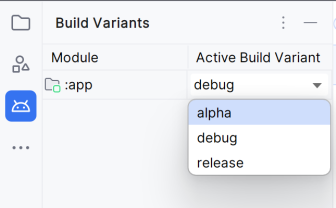

> 最近在项目开发中，遇到了需要依赖共同代码产出不同库的情况，踩了一些坑，现将一些想法记录下来，希望能给需要的读者提供一点思路

> 本文中Gradle的配置脚本使用了Kotlin，如你使用的是Groovy，配置方式可能有所不同。如果你不确定Groovy下如何修改对应的配置项，你可以通过搜索配置项名+Groovy来查看对应的配置方法。

## Build types,Product flavors和Build variants的关系
Gradle作为一种构建工具，其**主要作用是帮助开发者管理资源**的。开发者通过资源的不同组合，实现不同的功能，得到不同的产品。在这过程中，有些共同的资源被抽象出来了，所有的产品都需要这些资源。这种情况下，作为构建工具，Gradle理所应当也要提供相应的支持，所以`Build types`和`Product flavors`和`Build variants`就出现了。

首先，作为一个产品，绝大部分开发版和发布版是会有一些不同的，日志信息，后门功能，验证逻辑可能都不太一样。针对这种情况，Gradle提供了`Build types`。

随着产品开发，可能推出了会员版本，这时候产品不仅仅在开发和发布中有不同，在实现上也有不同了，所以Gralde为这种情况提供了`Product flavor`。

当然，无论是会员版本还是普通版本，它们都存在开发，测试，发布流程，每个流程和每个产品组合也需要提供配置方式，所以有了`Build variants`。它是前两项的组合，提供一种更细粒度的控制。

它们的相互配合，就产生了无尽的可能。接下来我将结合我实际使用，向读者阐述一下这些工具的应用场景。

## Build types
**Build types是开发，测试，发布等过程的一个配置层级，其作用是为这些阶段提供不同的配置信息，所以在资源项基本相同的情况下使用它**。如应用开发中，不同阶段通常有不同的接口地址，接口地址属于一种配置项，并且随着阶段不同而不同，所以`build type`就能很出色地完成这种任务。下面就用实例，简单地阐述一下`build types`是怎样起作用的。

首先我们需要一个项目，项目的原始目录结构如下

```shell
│  build.gradle.kts   	//下文用项目build文件代替
│  settings.gradle.kts	//下文用项目settings文件代替
├─app
│  │  build.gradle.kts 	//下文用app build文件代替
│  └─src
│      ├─main
│      │  │  AndroidManifest.xml
│      │  │
│      │  ├─java
│      │  │  └─io
│      │  │      └─hongui
│      │  │          └─gradlesample
│      │  │                  MainActivity.kt
```

### 默认的Build type
Gradle已经默认为我们添加了`debug`，`release`两种`build types`，分别代表开发阶段和发布阶段的配置，在app build文件中，我们可以查看Android Studio给我们生成的默认配置

```kotlin
android {
    buildTypes {
        // 开发配置
        debug{

        }
        // 发布配置
        release {
            isMinifyEnabled = false
            proguardFiles(getDefaultProguardFile("proguard-android-optimize.txt"), "proguard-rules.pro")
        }
    }
}
```

`debug`和`release`有着相同的配置项，只是取值不同，如

1. `isDebuggable=true`使得`debug`下可以使用调试器;
2. `isMinifyEnabled=false`不进行代码缩减，这会使得该模式下有安装包体积更大，如果为`true`则会移除没有使用到的类和方法，在使用反射时应注意;
3. `isShrinkResources=false`不进行资源缩减，使得无用的资源也被打包进安装包；
4. `versionNameSuffix+=".debug"`可以方便从版本信息中知道使用的是哪种发布模式；
5. `applicationIdSuffix+=".debug"`可以配置应用ID后缀，使得在同一手机上安装多种发布包；
6. `addManifestPlaceholders(mapOf("key" to "value"))`为`AndroidManifests.xml`添加配置。

诸如此类，更多配置项可查看[官方文档](https://developer.android.google.cn/reference/tools/gradle-api/7.3/com/android/build/api/dsl/BuildType)。

当然，除了开发和发布阶段，我们可能还需要测试阶段的配置，这就需要我们自己创建了。

### 创建新的Build type
在`buildTypes`构建块中，我们可以通过`create`方法来创建新的`Build type`。新的`Build type`和默认创建的两种是完全一样的，也有上面这些配置项可供使用。

```kotlin
android {
    buildTypes {
        // 开发配置
        debug{
            
        }
        // 新建的测试配置，名字是alpha
        create("alpha"){
            
        }
        // 发布配置
        release {
            isMinifyEnabled = false
            proguardFiles(getDefaultProguardFile("proguard-android-optimize.txt"), "proguard-rules.pro")
        }
    }
}
```

当你创建完后，Android Studio会在文件标签页下方提示你项目需要同步，点击`Sync Now`按钮，同步完成后，你可以在侧边工具中中找到`Build Variants`工具窗口，这时候，`Active Build Variant`中就会多一个`alpha`的构建选项



这就是告诉你，你可以发布`alpha`环境的包了。

可以看到大部分配置项都是为了区分环境而设置的，当然，我觉得目前为止，这些配置项对于应用开发是不够的，开发者需要的可能是更直观的区分，如应用图标，应用名称，而这些就要通过新的规则引入来实现了。

### 使用源代码集
Gradle除了提供配置项来配置环境，还提供了源代码集功能来区分资源，源代码集提供单独配置某个`Build types`的能力。通常一个module会在`src`目录下创建一个`main`目录，在该目录下存放代码和资源，我们称之为主源代码集。当我们希望`Build types`之间有所不同，要配置不同资源时，就可以**在**`**src**`**目录下创建和**`**Build types**`**同名的变种目录，称之为变种源代码集，它们的结构是完全相同的，可以存放变种特有的代码和资源**，在编译时，Gradle会把两个源代码集中的资源和代码放在一起编译，好像就是在同一个目录下一样。如我希望让应用在不同的环境下显示不同的应用名称或者图标，就可以使用源代码集功能实现。

1. 首先，我们需要确定目标模块，实例中目标模块是`app`;
2. 然后，我们进入到目标模块的`src`目录；
3. 接着以`src`为父目录，新建和`Build type`名字一一对应的文件夹，如`debug`环境，就新建`debug`文件夹；
4. 参考`main`文件结构，配置想区分的资源；
5. 同步

下面就是修改`alpha`和`release`模式下，应用名称的一个实例

```shell
app
└─src
    ├─alpha
    │  └─res
    │      ├─values
    │      │      strings.xml
    ├─main
    │  └─res
    │      ├─values
    │      │      strings.xml
    │
    ├─release
    │  └─res
    │      ├─values
    │      │      strings.xml
```

`strings.xml`定义了三个键相同，值不同的字符串资源，下面就是`alpha`,`release`环境下的运行效果。

 


当然，除了这些普通资源，代码也可以配置，只需要在上面目录结构的基础上，加上`java`目录，然后在对应包下添加文件，就好像直接写在`main`目录下的包中一样，只不过这些类只在目标构建类型和目录匹配时才会生效。

## Product flavors
大部分时候，`Build types`已经够用了，但是当我们需要两个或以上不同类型产品，但是大部分资源要共用的情况，就该考虑`Product flavors`了。如果说`Build types`完成的是动态的配置的话，`Product flavors`完成的就是静态的配置，正如它名字一样，它是用来区分产品的。

我们可以先来看看常用的配置项有哪些

```kotlin
android{
    defaultConfig {
        applicationId = "io.hongui.gradlesample"
        minSdk = 24
        targetSdk = 33
        versionCode = 1
        versionName = "1.0"

        testInstrumentationRunner = "androidx.test.runner.AndroidJUnitRunner"
    }
}
```

上面代码块中，`defaultConfig`构建块就相当于一个`Product flavor`，里面的内容都是它常用的配置项。可以看到，假如将这些都重新设置之后，它完全可以看成一个新应用了。

在以前，我常常在想，`Build types`和`Product flavors`有很多相似的地方，为什么要同时提供这两种配置方式。直到我在实际工作中遇到了问题，才慢慢理解这些东西。

在之前的工作中，我需要基于同一套`C++`代码和两套接口，提供两个功能类型不完全一样的sdk。最开始我想法很粗暴，直接新建另一个`module`解决。但是在实际开发过程中，我又同时需要共有一些`Kotlin`的代码来实现一些功能的复用，这些代码大部分是`internal`的，所以我为了共用代码，完全破坏了以前的封装，将很多不应该暴露出去的代码暴露出去了。所以我越想越觉得不对，最终通过研究Gradle的功能，开始尝试用`Product flavors`的思路解决这个问题。

为了更好地描述实际遇到的问题，我们的项目目录结构变成了这样

```kotlin
│  build.gradle.kts   	//下文用项目build文件代替
│  settings.gradle.kts	//下文用项目settings文件代替
├─app
│  │  build.gradle.kts 	//下文用app build文件代替
│  └─src
│      ├─main
│      │  │  AndroidManifest.xml
│      │  │
│      │  ├─java
│      │  │  └─io
│      │  │      └─hongui
│      │  │          └─gradlesample
│      │  │                  MainActivity.kt
├─sdk
│  │  build.gradle.kts 	//下文用sdk build文件代替
│  └─src
│      ├─main
│      │  │  AndroidManifest.xml
│      │  │
│      │  ├─java
│      │  │  └─io
│      │  │      └─hongui
│      │  │          └─sdk
│      │  │              Test.kt
```

我新建了一个`sdk`模块，接下来，我们需要在sdk build文件上下文章了。

### 创建Product flavor
创建`Product flavor`的第一步是用`flavorDimensions.add("sdk")`为`Product flavor` 指定一个dimensions，也就是起个名字。这一步很重要，不然会在编译时报错
`
Error:All flavors must now belong to a named flavor dimension.
The flavor 'flavor_name' is not assigned to a flavor dimension.
`
起好名字后，我们就可以使用`productFlavors`构建块创建`Product flavors`了。

```kotlin
productFlavors {
    create("hello"){
        dimension="sdk"
    }
    create("world"){
        dimension="sdk"
    }
}
```

除了指定好`dimension`，其他项就可以根据需要覆盖掉`defaultConfig`的内容就好了，和`Build types`差不多，问题出在了`app`模块引用`sdk`模块上。

### 依赖配置
在没有配置`Product flavors`情况下，我们引用本地module就直接`implementation(project(":sdk"))`就行，但是创建了`Product flavors`后，你再看，就报错了

```shell
Could not determine the dependencies of task ':app:lintVitalReportRelease'.

> Could not resolve all task dependencies for configuration ':app:releaseRuntimeClasspath'.

   > Could not resolve project :sdk.

     Required by:

         project :app

      > The consumer was configured to find a component for use during runtime, preferably optimized for Android, as well as attribute 'com.android.build.api.attributes.BuildTypeAttr' with value 'release', attribute 'com.android.build.api.attributes.AgpVersionAttr' with value '8.1.0', attribute 'org.jetbrains.kotlin.platform.type' with value 'androidJvm'. However we cannot choose between the following variants of project :sdk:

          - helloReleaseRuntimeElements

          - worldReleaseRuntimeElements

        All of them match the consumer attributes:

```

诸如此类，简单地说，就是它告诉你，`app`模块中引用的`sdk`定义了`Product flavors`，但是`app`中没有定义，构建`app`模块的时候，就不知道`app`该使用`sdk`的哪个`Product flavor`。按照这个思路，我们在`app`中定义同名的`product flavor`是不是就能告诉使用它要使用哪一个`Product flavor`了。

#### 同名Product flavors依赖
```kotlin
flavorDimensions+="sdk"
productFlavors{
    create("hello"){
        dimension="sdk"
    }
}
```

这相当于告诉Gralde，使用同名的`Product flavor`来依赖的`sdk`模块，它们的名字和`dimensions`必须一一对应。

#### 不同名Product flavors依赖
但是，有些情况下，我们可能没法创建同名的`Product flavor`，这种情况下我们就需要自定义一种匹配关系了，而这个配置项就是`matchingFallbacks`。

```kotlin
flavorDimensions+="sdk"
productFlavors{
    create("helloflavor"){
        dimension="sdk"
        matchingFallbacks+="hello"
    }
}
```

示例中，我们没有`hello`这种`Product flavor`，只有`helloflavor`。名字不匹配，Gradle无法确定应用用哪种`Product flavor`来构建`helloflavor`，所以同样会编译失败。所以我们手动指定了`matchingFallbacks`来告诉Gradle，如果找不到`helloflavor`，就找`hello`。我们知道`sdk`中是有`hello`的，所以匹配成功，构建通过。

#### 没有Product flavors依赖
更有，我们可能完全不需要创建`Product flavors`，我们只希望依赖`sdk`中的`hello`，但是不想麻烦地创建`Product flavors`，Gradle也提供了配置项`missingDimensionStrategy`。

但是虽然我们知道了配置项，但是由于没有创建`Product flavors`，这个配置项该写在哪里呢？还记得前面我说过`defaultConfig`相当于一种`Product flavors`吗，所以我们把配置项写在`defaultConfig`里。

它需要至少两个参数，第一个是指定`dimensions`，`sdk`中指定的是`sdk`，所以第一个参数为了匹配到这个`dimensions`也必须写成`sdk`。第二个参数起就是`Product flavors`的名字，如我们希望是`hello`，就是传`hello`。假如还有第二个库，第二个库有新的`Product flavors`，那么还得接着传递第三个参数，这个参数名同样要和第二个库中`Product flavors`的名字相对应。

所以，最终的配置就是这样

```kotlin
android {
    defaultConfig {
        applicationId = "io.hongui.gradlesample"
        minSdk = 24
        targetSdk = 33
        versionCode = 1
        versionName = "1.0"

        testInstrumentationRunner = "androidx.test.runner.AndroidJUnitRunner"

        missingDimensionStrategy("sdk","hello")
    }
}
```

### 添加源代码集
每个`Product flavors`通常都有自己的图标，名字，甚至自己的代码和资源，所以通常它会创建和`Product flavors`同名的文件夹，用于定制这个产品，也就是和`Build types`一样的源代码集。

## Build variants
`Build variants`是在**前两项中任取一项组合而成的产物，用于表示最终的安装包**。通常我们能从名字上就能看出产物是由哪些配置项组成的，因为它的命名规律是`<product-flavor><Build-Type>`。如前面的`sdk`库，由于我们创建了两种`Product flavors`，然后Gradle会为我们默认创建两种`Build types`，两两相组合，所以最终会产生四种`Build variants`

+ helloDebug
+ helloRelease
+ worldDebug
+ worldRelease

它们作为最终的组合体，同样可以配置源代码集，里面资源会替换前面某个单独的`Build types`或者`Product flavors`。

值得一提的是，Android Studio提供了Build variants的Tool window，方便开发者快速在这些产物间切换，切换完后，下一次点击`Run`就会使用选择的Build variants打包了，你可以在Android Studio的侧边栏找到它，如果没有可以在菜单->View->Tool Windows->Build variants路径下找到它。

## 总结
虽然，这三个配置功能，有很多共同之处，都可以使用源代码集，都可以设置一些环境区分选项。但是它们并不是重复设计，而是代表着不同的理念和粒度，在实际项目中，应该根据实际情况做不同的选择。

`Build types`更多针对的是发布模式，方便对开发，测试，发布等阶段进行隔离，通常在功能上不会有很大差异，适合那些环境区分的设置。

`Product flavors`针对的是产品本身的区别，适合在那些需要发布多个产品，但是共用资源的情况，相当于是一种产品隔离。

`Build variants`则是发布模式和产品区别的组合，因为多个产品同样需要发布模式的区分。

总结一句话，这三个都是**用来实现隔离功能的，**`**Build types**`**是环境隔离，**`**Product flavors**`**是产品隔离，**`**Build variants**`**是产物隔离**。

好了，今天的分享就到这里，如果需要源码，可在[这里](https://gitee.com/hongui/gradle-sample)找到，希望大家有所收获！

