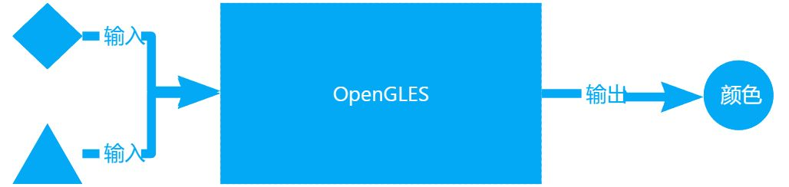
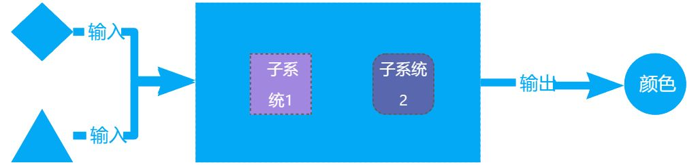
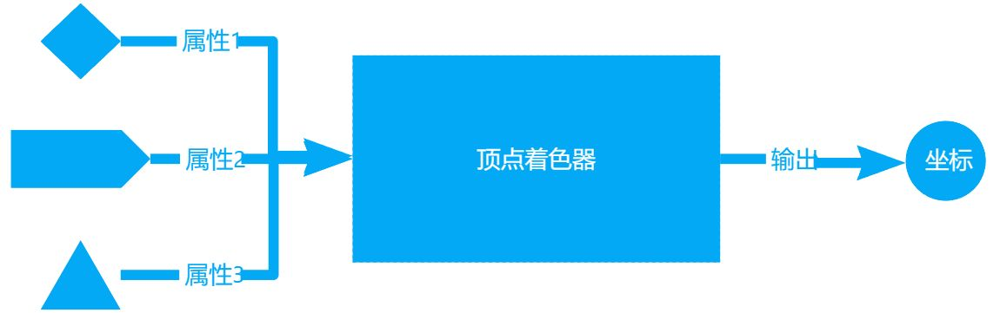
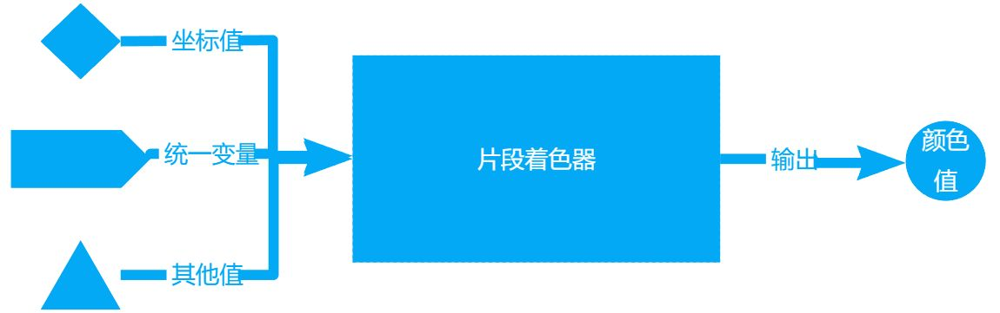
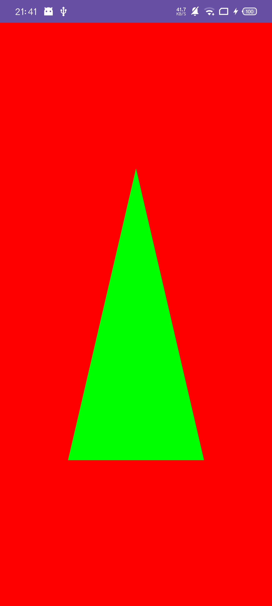
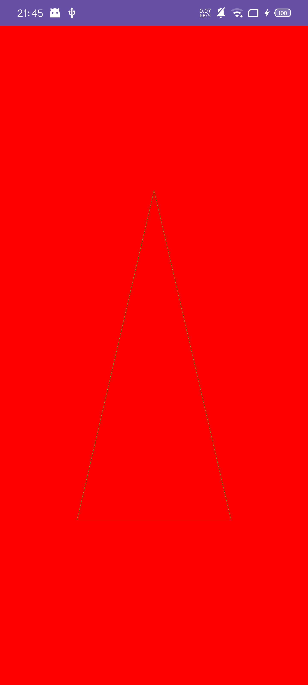
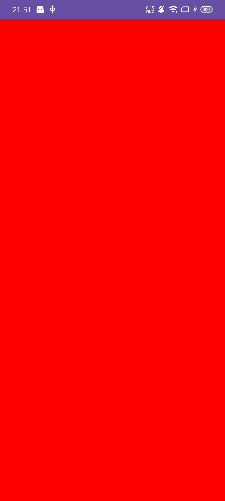

>  大学时期有一门课叫《信号与系统》，课堂上老师给我们讲了关于系统的理解——系统是根据输入产出输出的黑箱，一个稳定的系统，只要输入固定，输出也总是固定的。所以要分析一个系统，可以从分析它的输入输出开始。**OpenGLES API也组成一个系统**，为了弄清楚它是怎么工作的，我们也可以从它的输入输出开始入手。
>

## OpenGLES系统
OpenGLES系统很容易明确的是输出，它的**总是输出颜色值**，从而我们也明确了这个系统的功能——产生颜色值。但是为了实现这个功能，OpenGLES定义了一套规则，能将所有合法的输入，通过适当的转换，产出颜色值。所以从这方面来看，**OpenGLES是一个按一定规则产生颜色值的系统**。



这个规则怎么产生呢，虽然我们不知道，但是我们可以根据生活经验猜测：我们的输出是固定的颜色类型，无论最初的输入是什么形式，越靠近输出的状态值就应该会越接近颜色值，不然最终功能肯定无法完成。按照这个推论，如果我们把这个系统划分成多个子系统，前一个子系统输出的值作为后一个子系统的输入，每个子系统都产生某种固定的中间值，那么我们就把复杂的大系统转化为了更简单一些的小系统了。所以一个基本的指导思想就浮出水面，**将系统的转换过程划分为几个阶段，每个阶段又是个独立的子系统，有自己的输入和输出，负责特定的功能，产生特定的值**。



OpenGLES将这种子系统划分称为渲染管线，每个子系统称为着色器，着色器间前后依赖，后一个着色器输入依赖前一个着色器的输出。


这张图就是这个系统的子系统划分方式，箭头方向就是数据流转方向，上一个系统产生的输出可以供后面系统直接使用。就是靠这种方式，一组顶点数据才能转换成各种颜色。在图的上半部分是关于如何将一组顶点数据转化为坐标信息的，其中关键部分就是顶点着色器，我们可以通过编程来让它接收合适的数据，然后产生有用的输出。至于图的下半部分，关键则是片段着色器，它利用前面产生的坐标信息和中间计算值，生成颜色值。

对于使用OpenGLES API的使用者来说，我们只需要了解顶点着色器（Vertex Shader）和片段着色器（Fragment Shader）就够了。

## 顶点着色器
在开始解释顶点着色器之前，首先我们需要明确的是，**着色器都运行在GPU**中，它运行的数据需要存储在显存中。普通的代码运行在CPU中，数据存储在内存中。为了让GPU有活可干，我们需要负责将数据从内存搬运到显存，这就是第一个任务。那么数据哪里来，怎么组织数据呢？这就是顶点属性的任务。

前面说了半天的顶点数据，还没解释它是什么东西。从最简单的情况来看，它可以理解成是坐标值的集合，每一组包含相同的数据，如x,y,z等，但是为什么不直接称之为坐标值呢？因为它除了可以有坐标值外，还可以有颜色值，大小值等任何你想存储的数据。把这些想存储的数据分成一组一组的，每组包含相同的数据，并且数据的存放顺序也保持一致，然后把它们从内存传到GPU显存，这个时候就可以称之为顶点数据了。这也是上图的第一个阶段。

数据存在显存里一直不用肯定不行，于是我们给它安排了一个程序，让程序去读取显存中一组一组的信息，然后组成程序的输入，这就是顶点着色器，并称输入为顶点属性。根据数据形式的不同，顶点着色器会定义不同的属性，也可能会定义片段着色器可能需要的属性作为输出。



顶点着色器的魔法在于**坐标变换，如旋转，缩放，平移**等都在这个阶段完成。

## 片段着色器
片段着色器的输入可以有两方面，一种是统一变量（uniform），另一种是来自顶点着色器的输出，也就是坐标值。它的主要功能就是输出颜色值。



相比顶点着色器，片段着色器是魔法产生的地方，各种滤镜，特效都是由它完成的。关于它我们先知道它是根据坐标算颜色值的就够了，魔法暂不展开。

## 着色器程序
前面的章节我们说过，着色器是作为一个子系统存在的，为了完成整个系统的功能，我们需要将各个子系统间串起来，完成这个任务的就是着色器程序。这句话什么意思呢，就是着色器相当于一个办公室，顶点着色器，几何着色器，片段着色器等其他都在这个办公室里面办公，工作来了，只能通过着色器程序开出的窗口办理。具体着色器程序会怎样协调，不需要我们操心。也就是说**着色器程序功能由着色器实现，着色器组成了着色器程序**。

## OpenGLES是怎么画图的
前面我们铺垫了很多知识，只为了能够画出一个三角形。但是到目前为止，可能很多读者还是一头雾水，因为我一直在搭框架，没有涉及到任何细节。没办法，这一阶段需要接触的新概念太多了，为了不迷糊，我需要将概念先放到合适的位置上，再慢慢展开它的细节。为了再次帮助读者将上面的东西串起来，我们从OpenGL ES画图流程的角度来看一看上面的东西是怎样串起来的。

1. 创建一个着色器程序，获得访问着色器办公室的办事窗口的凭证； 
2. 创建顶点着色器，片段着色器，编写并关联源码；
3. 利用步骤2中获得的凭证，将步骤3中两个着色器关联到着色器程序上；
4. 利用步骤2中获得的凭证，设置它关联的顶点属性，填充数据；
5. 画图。

可以看到，着色器程序是扮演着绝对的主角，它作为数据，着色器，绘制的交互接口，所有的操作都围绕它展开。接下来，我将用上面的这些概念模型和上面的流程来深入讲解更多的细节，如果你在细节的海洋中忘记了你的位置，你可以重新查阅这一节，相信它能给你一些提示。

## 准备工作
在开始真正的代码实现前，我先假设读者已经阅读过我的上一篇文章，或者了解EGL相关知识，会搭建EGL环境。另外，项目工程也会沿用上一篇中的工程，只是做出以下改动。

1. EGL相关独立成一个文件
2. OpenGLES独立成一个文件
3. 使用OpenGLES 3.0 API

除此之外，我们还有必要准备一下OpenGLES API相关的知识。

OpenGLES提供了很多API，它们可以帮助开发者实现各种高性能，高复杂度的功能，但是这对初学者来说可能不太友好。作为初学者，我们只需要有限的几个API，用于验证我们的理解，完成一些简单的效果。所以，我就觉得有必要对这些API做一个归类和概括。

OpenGLES的API虽然是C接口，但是概念上却是以对象为配置单位的。所以在我看来可以将这些API分成三类：**创建对象类，配置类，数据传输类**，并且大部分接口都是按照这个顺序来使用的。如OpenGLES API中可以创建多种Buffer，几乎所有的Buffer使用流程都是一样的：**先创建一个Buffer，然后绑定Buffer，最后就是往Buffer传输数据**。

另一个规律就是，**如果一个接口没有传递配置对象，那么配置对象就是指最后绑定的那个**。

好了，准备工作先做这么多，让我们正式开始。

## 创建着色器程序
着色器程序对象作为OpenGLES API中最重要的角色，要想开展工作，肯定先要搞个对象。遵循前面我说的规律，按照创建，配置，传输的步骤，我们找到了专门创建着色器程序的API——`glCreateProgram`。它会返回一个整数，如果等于`GL_NONE`则说明创建失败，否则该整数就代表一个着色器程序对象，后续接口中用到着色器程序的都可以传递这个值代表，也就是上文中所说的着色器的办事窗口。失败的话，可以使用`glGetError`查看错误码，并定位问题。如果一切顺利，我们就可以得到一个空的办公室，等待办事单位入驻。按照规律，第二步就该配置了，着色器程序最重要的配置工作就是，绑定着色器，也就是具体的办事单位。

综上，这一步的代码很简单，只有两句

```kotlin
val program = GLES30.glCreateProgram()
if (GLES30.GL_NONE == program) {
    return null
}
```

## 添加着色器
着色器又是一个新对象，又是创建，配置，传输的步骤，但是请保持清醒：这是配置着色器程序的子步骤。于是我们又找到了创建着色器的API——`glCreateShader(type:Int)`。可以看到它多了个类型的参数，因为我们有顶点着色器和片段着色器，创建哪一种着色器，传输对应的类型就可以了。如果创建成功，返回值同样代表着这个着色器对象。有了对象，接下来就是配置环节了。

由于着色器的作用是运行代码，所以它的配置工作主要是将色器语言GLSL(OpenGL Shading Language)写成的字符串块关联到着色器对象上，并保证可以正常工作。所以首先第一步是先使用`glShaderSource(type:Int,source:String)`关联代码，然后使用`glCompileShader`来查看关联的代码是否有错误，如果一切顺利，着色器的配置工作就完成了。

由于两种着色器除了代码和类型不同外，配置过程完全一致，所以，我们可以写出下面的方法，通过传入类型和代码，就可以得到对应的可正常工作的着色器对象。

```kotlin
fun createShader(type: Int, source: String): Int? {
    val shader = GLES30.glCreateShader(
        when (type) {
            VERTEX -> GLES30.GL_VERTEX_SHADER
            FRAGMENT -> GLES30.GL_FRAGMENT_SHADER
            else -> return null
        }
    )
    if (GLES30.GL_NONE == shader) {
        log()
        return null
    }
    GLES30.glShaderSource(shader, source)
    GLES30.glCompileShader(shader)
    if (GLES30.GL_NO_ERROR != GLES30.glGetError()) {
        log()
        return null
    }
    return shader
}
```

完成了着色器的子过程，我们接着配置着色器程序。着色器对象虽然创建出来了，但是它们是分散孤岛，谁也不认识谁，更别提相互配合工作了。所以要通过着色器程序，将它们关联在一起，关联包括两个步骤。第一步先将着色器程序对象和着色器对象关联在一起，这样着色器程序就知道着色器在哪里了，这一步使用`glAttachShader`，注意，我们有两个着色器对象，所以要调用两次。第二步将整个系统对象关联起来，检查它们之间是否可以共同工作。因为着色器间相互依赖，即使每个着色器都正常工作，但是某个着色器的输入输出不匹配，也会导致整个系统无法正常工作。由于某个整个系统因为某个第一步只能解决当个着色器正常与否，第二步才能确定整个系统正常与否。

```kotlin
openGLES.use {
    GLES30.glAttachShader(it,vertexShader)
    GLES30.glAttachShader(it, fragmentShader)
    GLES30.glLinkProgram(it)
}
```

## 数据和绘制
经过前面的两大配置工作，现在这个办公室总算施工结束了，有了办公室，也有了办事部门，但是没有事情可做。要让它们有事可做，首先要有数据，而数据通常是从内存传过来的。

传递数据的方式就是给顶点着色器的顶点属性赋值，但是怎样保证数据传递给了对应的顶点属性呢？显然我们不知道，所以我们需要一种方式来标识顶点属性。OpenGLES API使用整型数值来标识顶点属性。为了能说明这种方式，我们需要看一看前面生成顶点着色器的代码：

```glsl
#version 300 es
layout (location = 0) in vec3 aPos;
void main(){
  gl_Position=vec4(aPos,1.0);
}
```

暂且不看其他部分，我们只看第二行的`layout (location = 0)`。这个语法是告诉着色器程序，假如我在配置`aPos`这个顶点属性时，我会使用它的标识号`0`来代替。简单来说就是调用API时，给顶点属性变量传递`0`，代表数据会传递给`aPos`这个顶点属性。如下面这行代码

```kotlin
GLES30.glEnableVertexAttribArray(0)
```

这行代码的作用是开启顶点属性，使之可用。开启哪个呢，`0`这个顶点属性，`0`代表哪个属性呢，`aPos`顶点属性。现在`aPos`可用了，该怎样将顶点数据传给它呢，这就要讲到目前为止最复杂的一个API了，我们先来看看示例代码是怎么写的

```kotlin
GLES30.glVertexAttribPointer(0,3,GLES30.GL_FLOAT,false,0,buffer)
```

1. 第一个参数最简单，就是前面提到的顶点属性的标识。示例中传递了`0`，代表着将数据传递给`aPos`这个顶点属性。
2. 第二个参数得看顶点着色器中的代码的第二行，`layout (location = 0) in vec3 aPos;`，前半部分的作用我们已经知道了，`in`表示这是一个输入变量，关键在于`vec3`。`vec3`是GLSL的内置类型，可以分为两部分`vec`代表数据是`float`类型，`3`代表三个元素，所以组合起来就表示由三个`float`组成的向量。而第二个参数的含义是顶点属性的组成元素个数。所以答案显而易见，`aPos`是3向量类型，组成元素是`3`。
3. 第三个和第二个参数其实关联很大。第二个是顶点属性组成个数，第三个是顶点属性组成类型，所以答案已经在第二个参数那里揭晓了，是`float`类型。到这里，我发现前三个类型都只是在**描述顶点属性这个类型**。
4. 第四个参数决定是否将数据标准化，也就是转为[0,1]区间的数。我们自己的数据已经是[0,1]的数了，所以不转。
5. 第五个也不好理解。我们先来看示例的数据

```plain
-0.5f, -0.5f, 1.0f,
0.0f, 0.5f, 1.0f,
0.5f, -0.5f, 1.0f
```

由于我们要画三角形，所以需要三个点，每个点由`x`,`y`,`z`组成，所以示例的数据有9个值。而如果我们想在每一个的数据后面加入其他数据，如颜色的`alpha`值，则每个点的数据由3个值变成了4个值，要怎样保证这种情况下，三角形的三个点还是原来的值呢，这就是这个参数的作用。这个参数告诉着色器程序，**传给它的数据该怎样分组**。由于前三个参数已经确定了每个属性读取的数据大小，当读取了这么多数据后，后面的数据理所应当应该是另一组的数据开始。但是其实这组数据还没有完，还有第四个`alpha`值，它的大小要在原来的顶点属性数据大小的基础上加个`1`，这就是这个参数的含义——**除了顶点数据的大小，还需要加上几个值，才是完整的一个分组**。示例里面传了`0`，因为我们每组顶点数据大小就是3个值，没有多余的值。假如加入一个`alpha`值，则传参的时候，这个值应该传`1`.

6. 最后一个当然就是具体的值了。这里有两个值得注意的点。一是`ByteBuffer`的必须是通过`allocateDirect`方式创建，二是需调用`order(ByteOrder.nativeOrder())`设置字节序，其余就没啥了。

终于，最难的部分我们已经闯过去了。目前为止，画图的程序，画图的数据都准备好了，终于可以画三角形了。画图只需要一个指令`GLES30.glDrawArrays(GLES30.GL_TRIANGLES,0,3)`。这个API最关键的参数是第一个，它决定了怎样组织顶点着色器输出的点，是绘制一个一个的点，还是绘制这些点组成的线，还是三点构成的三角形。可以看看不同不同参数下，它们的不同效果

 

可接受的值有这一些， GL_POINTS, GL_LINE_STRIP, GL_LINE_LOOP, GL_LINES, GL_LINE_STRIP_ADJACENCY, GL_LINES_ADJACENCY, GL_TRIANGLE_STRIP, GL_TRIANGLE_FAN, GL_TRIANGLES, GL_TRIANGLE_STRIP_ADJACENCY, GL_TRIANGLES_ADJACENCY, GL_PATCHES，感兴趣的可慢慢研究。

## 总结
OpenGLES比一般开发更难是因为要同时管理程序和数据，程序和数据相辅相成，程序依靠数据运行，数据决定程序怎么组织代码。

程序包括着色器程序和着色器，着色器程序负责提供接口和管理着色器和数据，而着色器是整个系统的重要组成部分，它们决定了整个系统怎么运转。顶点着色器负责将顶点属性转化为坐标信息和可供片段着色器使用的输出。片段着色器负责计算颜色值，计算来源可以使用顶点着色器的输出，也可以使用统一变量。

数据是另一个重要的课题，可以是普通的顶点数据，也可以是存储在显存上的纹理数据，甚至是前一个系统计算的颜色值。

而不论是程序还是数据，OpenGL ES都有丰富的API可供使用。依旧是创建，配置，传输的分类和顺序。创建Buffer对象，着色器对象，着色器程序对象。配置Buffer数据，着色器源码，着色器程序。传输顶点数据，统一变量，纹理数据等等。都需要分情况，分场景使用。

今天暂时分享到这里，咱们青山不改，绿水长流，下期见。

### 相关资源
[项目源码](https://github.com/hongui/OpenGLES/releases/tag/triangle)

[参考文档](https://registry.khronos.org/OpenGL-Refpages/es3.0/)

