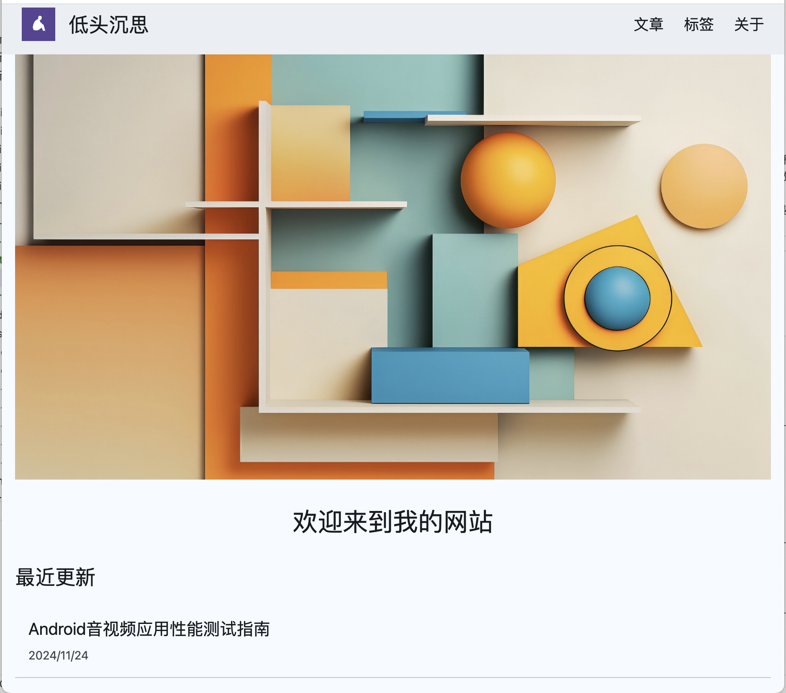
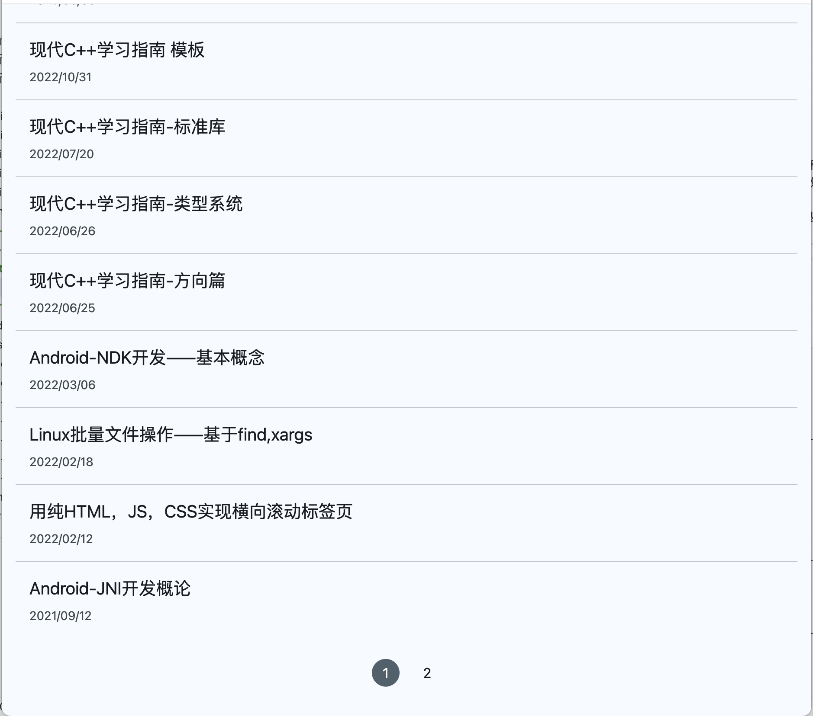
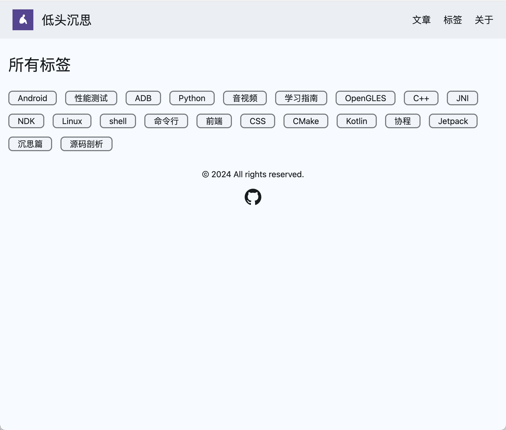
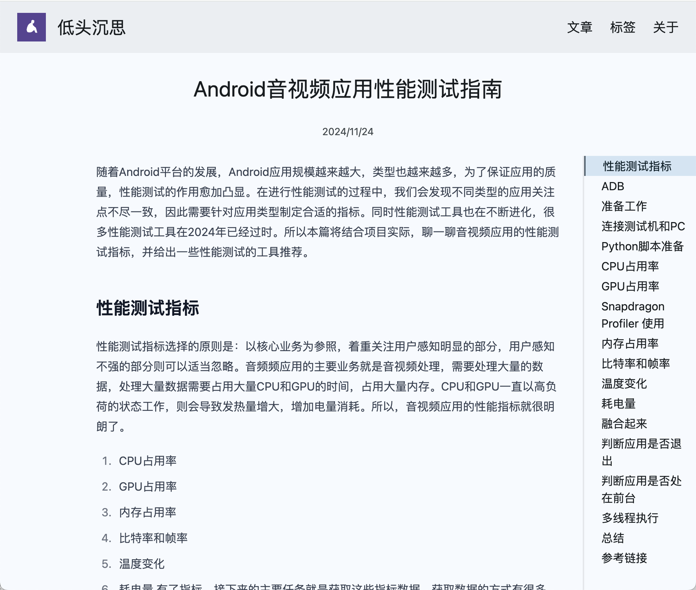
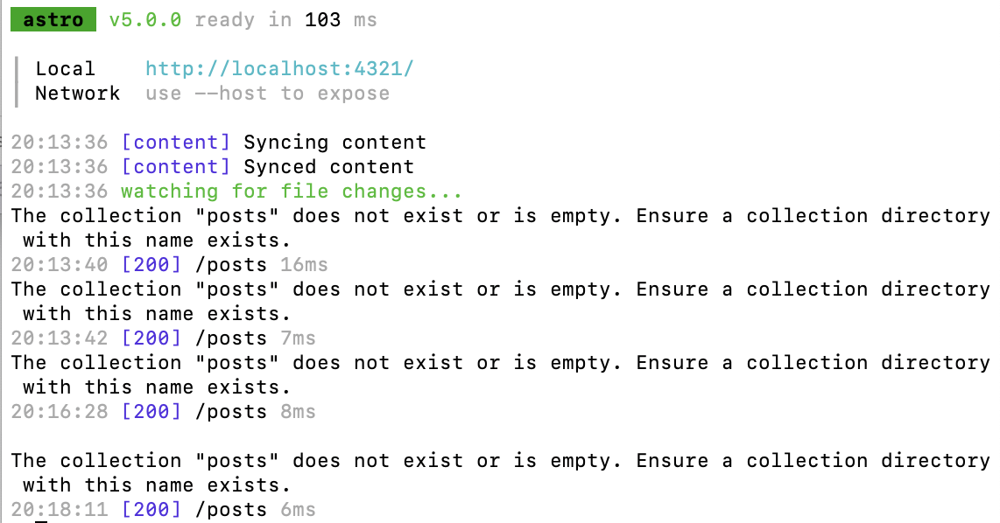
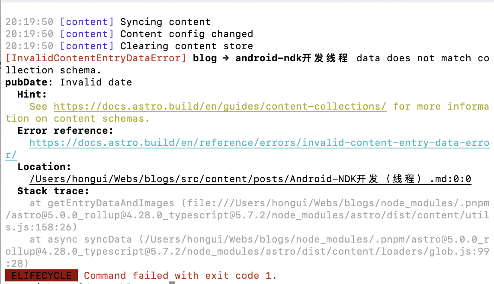

经过一周多的努力，终于把Hugo迁移到了Astro，并且可以正常访问了。这中间踩了很多坑，在此记录一下，希望对大家有所帮助。
## 网站预览





## 缘起
之前的博客一直用Hugo生成，前前后后找了很久的主题，Hugo和主题文档反复看了好几遍终于将博客折腾上线了。上线后由于很久没更新博客，前不久更新了一篇，发现Hugo生成又失败了。于是又去Hugo官方查，发现Hugo更新了很多版本，有些特性去掉了或者优化了。无奈只能重新按照说明修改配置。配置修改后，发现还是生成失败，于是又去主题文档上查询了一波，发现主题并没有适配最新的0.138。无奈只能修改主题，同时更新了一下主题仓库。这一折腾不要紧，折腾后发现时间没有了，很多地方的样式也变了。当前要紧的是先把时间加上，折腾了一会，发现都不是很满意。于是起了重新找主题的想法。找了一圈下来，不是这里不满意就是那里不满意。于是心一横，想着直接换生成工具。这就找到了Astro。
## Astro
我并不是专业前端，对前端框架了解得不多，更别说Astro了。之所以选择Astro，仅仅是因为Astro能生成静态页面，并且能和Hugo一样很方便地使用Markdown。
同时，我自认为博客网站应该去除尽可能多干扰阅读的东西，只保留原汁原味的内容，也就是只要快和纯粹。刚好Astro就是出了名的快，而且以后改点小样式再也不用到处跑，就直接Astro一把梭，想想还是很完美的。
另外Astro还有很多官方模板，适合各种场景，比如就有个人博客的模板，我跑了一下，效果挺不错，比我现在用的博客主题都好看，一激动就开干了。但没想到问题接踵而至，为了不打脸，一咬牙直接搞了一个多星期才搞定。
## 开始之前
在开始之前，我们先要准备好以下环境。
- Node
- 包管理系统-Pnpm
前端项目，Node环境毫无疑问是必不可少的。
包管理系统我选择的是pnpm，主要是想少占用点磁盘空间，而且命令可以少敲点键盘。
## 新建Astro项目
我按照Astro[官方文档](https://docs.astro.build/zh-cn/install-and-setup/)新建了一个项目。这里虽然没有坑，但是也有几个值得关注的点。
首先，新建项目是可以指定模板的，模板可以节省很多配置和添加文件的操作，能让我们快速完成项目配置，专注到项目的业务。由于我做的是博客，所以我用下面的命令建的项目
```bash
pnpm create astro@latest -- --template blog
```
命令开始执行后，工具会让你做一些交互，用于配置项目。其中我觉得需要注意的是Git配置这个，因为我们是迁移，希望还保存以前的提交记录，所以选择不新建Git仓库。稍后我们将使用原来的博客仓库来替代。我的配置选择如下

等待工具执行结束，根据它的提示，直接去到项目根地址，执行`pnpm dev`命令，点击链接地址，就可以在浏览器上看到博客效果了。后续我们更改内容时也是一直保持`pnpm dev`运行，可以及时看到哪些内容有问题。同时，在配置项目的时候，我们也本着效果第一点的原则，先修改内容，再修改样式。如果你坚持到这里，那么，我们就成功走完了第一步，让我们继续。
## 复制原始博客内容
首先，让我们来看一看目前的项目结构。
```bash
├── README.md
├── astro.config.mjs
├── package.json
├── pnpm-lock.yaml
├── public
│   ├── blog-placeholder-1.jpg
│   ├── blog-placeholder-2.jpg
│   ├── blog-placeholder-3.jpg
│   ├── blog-placeholder-4.jpg
│   ├── blog-placeholder-5.jpg
│   ├── blog-placeholder-about.jpg
│   ├── favicon.svg
│   └── fonts
│       ├── atkinson-bold.woff
│       └── atkinson-regular.woff
├── src
│   ├── components
│   │   ├── BaseHead.astro
│   │   ├── Footer.astro
│   │   ├── FormattedDate.astro
│   │   ├── Header.astro
│   │   └── HeaderLink.astro
│   ├── consts.ts
│   ├── content
│   │   └── blog
│   │       ├── first-post.md
│   │       ├── markdown-style-guide.md
│   │       ├── second-post.md
│   │       ├── third-post.md
│   │       └── using-mdx.mdx
│   ├── content.config.ts
│   ├── layouts
│   │   └── BlogPost.astro
│   ├── pages
│   │   ├── about.astro
│   │   ├── blog
│   │   │   ├── [...slug].astro
│   │   │   └── index.astro
│   │   ├── index.astro
│   │   └── rss.xml.js
│   └── styles
│       └── global.css
└── tsconfig.json
```
这里有几个值得关注的部分。
`public`是存放静态资源的地方，比如图片，字体等。
所有的内容都在`src`目录下。里面有一个`pages`文件夹，里面放着所有的页面，我们后面的页面逻辑都在这里面。`content`则是存放Markdown文件的地方，我们后面会讲到。
为了尽快看到内容，我们需要复制以下目录的内容到对应的目录中。
```bash
.git        =>  .git
static      =>  public
content     =>  src/content
```
做完这几步，我们的旧博客部分就全部迁移过来了，只是没有任何原来的样式了。这时，假如你开着开发模式，并且看到控制台，你就会发现它报错了，提示找不到`posts`目录。

因为此时我的`content`目录如下
```bash
content
│   ├── about
│   ├── blog
│   ├── posts
```
所以下一步就是配置Markdown内容。
## 链接到Markdown文件
Astro使用内容集合管理Markdown文件，主要的文档在[这里](https://docs.astro.build/zh-cn/guides/content-collections/)。我简单地概括如下：
- `content`目录下的直接子目录都是一个内容集合，如上面我的目录，我就有三个内容集合，分别对应`about`，`blog`，`posts`；
- 内容集合可以嵌套，可以用子目录组织内容；
- 内容集合中存放的Markdown文件，需按一定的格式保存一些源数据（frontmatter），比如渲染阶段标题，日期等；
- 内容集合在编译阶段能校验Markdown文件，确保Markdown文件有有效的frontmatter；
- 内容集合的内容需要我们自己决定导出，以及决定校验的frontmatter。

有了这些信息，就足够我们继续往下开展工作了。
首先，我们需要在`src/content.config.ts`中配置内容集合。可以看到里面已经有了`blog`，我们只需要按照`blog`的格式添加`posts`。
```typescript
import { defineCollection, z } from 'astro:content';
import { glob } from 'astro/loaders';

const posts = defineCollection({
	loader: glob({ base: './src/content/posts', pattern: '**/*.{md,mdx}' }),
	schema: z.object({
		title: z.string(),
		description: z.string(),
		date: z.coerce.date(),
		tags: z.array(z.string()),
		draft: z.boolean().optional()
	}),
});

//about同理

//最后记得导出
export const collections = { posts,about };
```
`defineCollection`函数接收一个对象，对象中有两个属性，`loader`和`schema`。`loader`是一个函数，用于告诉它去哪里，找什么文件，`schema`是一个Zod对象，用于校验Markdown文件的frontmatter。原来Hugo的Markdown文件中刚好就有这些信息，我们只需要确定这些数据的格式就可以了。
如果一切顺利，那么现在Markdown文件已经导入到项目里了。但是如果某一个Markdown文件的frontmatter格式不正确，就会报错，如下。

就对着路径一个一个改就行，如果实在太多，就在上面的`src/content.config.ts`中直接去掉验证就好。
## 访问Markdown文件
上一步虽然我们已经导入了Markdown文件，但是现在我们访问不了，因为还没有路由，也就是Astro不知道输入某个地址后它该去哪里找显示的页面，显示的页面也不知道该使用哪一个Markdown文件。所以接下来为了能看到我们的文章，我们需要做两步：路由配置，页面配置。
### 路由配置
Astro里面配置[路由](https://docs.astro.build/en/guides/routing/)很简单，就是**根据URL创建对应的目录和文件**，比如模板文件中的`/blog/first-post`对应`src/pages/blog/[...slug].astro`。根据这个规则，我原来的博客结构是`/posts/xxx/index.md`，那么对应的路由就是`/posts/xxx`。这里`posts`很好理解，就是在`src/content/`目录下新建个`/posts/`目录。但是`xxx`就比较麻烦了，因为文章名是随意的，而且会不断增删，不可能为每个Markdown文件都单独配置一个文件夹，恰好Astro想到里这点，引出了所以动态路由。
在解释动态路由前，我们先来探讨一下静态路由，静态路由总结下来就是两个规则：
- 路由路径和文件路径是一致的；
- 直接访问某个目录，会查找这个目录下的`index.astro`文件作为渲染页面。

动态路由的动态则体现在命名上，如果目录名是`/posts/[slug]`，那么访问`/posts/123`，Astro就会使用`src/pages/posts/[slug]/index.astro`这个文件渲染页面。也就是说`[xxx]`代表一个可变的目录，注意这里`[]`是必须的，里面的`xxx`则可以随意取名，这种情况之对应这单层目录名可变的情况。如果URL的层级是变化的，可能是一级也可能是多级，那么就需要使用剩余参数。剩余参数形如`[...slug].astro`可以匹配多个层级，比如`/posts/123/456/789`，访问`/posts/123/456`，Astro就会使用`src/pages/posts/[...slug].astro`这个文件渲染页面。
综上，我们通过***在`src/content/`目录下新建个`posts`目录，在`posts`目录下新建`[...slug].astro`文件，就能让所有的Markdown文件匹配到这个页面***了。但是路由配置的流程远没有结束，因为***动态路由包含两部分，一部分是文件结构的配置，另一部分是路由导出的部分***。怎么理解呢，当我们访问正确的Markdown文件希望能渲染出文件中的内容，当访问没有在内容集合中的路径，我们希望Astro返回404。而哪些是正确的，哪些是错误的这个判断需要我们告诉Astro，告诉的方式，就是在文件中导出的`getStaticPaths`函数。

明确了`getStaticPaths`函数的功能，它的实现也不难推导出来，我们需要通过某种方式查询出所有的Markdown文件，用路径来填充动态路由的参数，然后返回一个数组，数组的每个元素都是一个对象，对象中有两个属性，`params`和`props`，`params`是动态路由的参数，`props`是页面需要的数据。查询Markdown文件的方式，接着内容集合的部分，Astro提供了`getCollection`函数，它接收一个内容集合的名字，返回一个数组，数组的每个元素都是一个Markdown文件的元数据，元数据中有id,title,description等，我们只需要把id作为参数，其他数据作为props，就能完成路由配置了，这就是我们在`src/pages/posts/[...slug].astro`文件中的代码。
```astro
---
import { type CollectionEntry, getCollection } from 'astro:content';
import BlogPost from '../../layouts/BlogPost.astro';
import { render } from 'astro:content';

export async function getStaticPaths() {
	const posts = await getCollection('posts');
	return posts.map((post) => ({
		params: { slug: post.id },
		props: post,
	}));
}
type Props = CollectionEntry<'posts'>;

const post = Astro.props;
const { Content } = await render(post);
---

<BlogPost {...post.data}>
	<Content />
</BlogPost>
```
这时候如果你开着开发模式，你应该能通过输入某个Markdown文件的路径，看到对应的页面了。但是手动输多麻烦呀，我们可以学着模板文件中的内容，在`src/pages/posts/`目录下新建`index.astro`文件，然后把模板文件中的内容复制过来，替换文件中的`blog`为`posts`。这样，我们就可以直接在浏览器中输入`http://localhost:4321/posts`查看所有的Markdown文件了，点击某个列表项，还可以查看到正确的页面。
### 页面配置
虽然我们已经成功看到了渲染的页面，但是我们还没有明白发生了什么，接下来我们接着上一节的内容，讲讲页面是怎么来的。
Astro将一个`.astro`文件分成了两部分，***上半部分是脚本，下半部分是页面。脚本用`---`来包裹，默认在编译阶段执行。页面跟在脚本后面，用于生成UI。它可以使用各种UI框架，也可以使用普通HTML标签。在编译阶段，编译器首先执行`getStaticPaths`来获得路由信息，然后编译器根据路由信息，执行剩余的脚本内容得到渲染数据，最终将渲染数据和页面模板组合在一起，得到最终的页面。***拿前面的例子举例，在脚本内容中，除了导出的`getStaticPaths`函数和导入语句，就是最后两行代码了。
先来看第一行
```astro
const post = Astro.props;
```
这一行的目的是将路由对应的Markdown文件的元数据读出来。记得这个数据哪里来的吗，在`getStaticPaths`中返回的。得到了源数据，在第二行使用官方库`render`，将Markdown文件渲染为UI。到这里依然还只是数据的部分，依然要记得执行在编译阶段。接下来需要移步到页面部分，看看UI是怎样使用这些数据的。
```astro
<BlogPost {...post.data}>
	<Content />
</BlogPost>
```
在UI部分，我们可以看到，页面中使用了脚本执行后的变量：`post`，`Content`。这也是Astro的一个规则，***页面可以直接使用脚本生成的变量***。
根据这个例子，让我来尝试总结一下这一整套流程：开发者通过一定的逻辑，得到路由信息，并通过`getStaticPaths`返回对应的路由和数据。编译器编译时调用`getStaticPaths`，得到路由信息，并使用路由依次生成页面。在生成每个页面的过程中，先执行脚本部分，得到渲染UI需要使用到的数据，最后根据页面模板组合脚本数据，得到最终的HTML页面，这就是Astro静态页面生成的基本流程。
其他概念，像组件，布局等都是比较常见的概念就不再赘述，需要的时候可以查询官方文档。至此，好像我们的博客迁移已经搞好了。实则是万里长征才走到遵义。接下来还有国际化和主题两大主题。
## 国际化
### 路由
由于之前到博客有英文版本，所以国际化支持是必不可少的。虽然目前只有中英两种语言，但是考虑后面的变化，我还是没使用[官方文档](https://docs.astro.build/zh-cn/guides/internationalization/)中的方法。官方文档中国际化方式只有两种方法可以选择：
1. 使用默认语言+其他语言的形式，这种形式的优点是，完美匹配我之前Hugo的路由格式，缺点是会存在两个基本相同的文件，分散在不同的目录中。
2. 所有语言都使用相同的文件，但是当访问不带语言前缀的地址时，会发生404错误。
这两种方法都各有优缺点，但是和我预想的还是有区别。首先我希望所有的多语言文件都只存在一份，通过数据来反应多语言。其实我想中文去掉默认的语言前缀。通过摸索，我找到了`Astro.rewrite`。
首先使用官方的方法2，我创建了`src/pages/[lng]`目录，在目录下新建`index.astro`文件，作为博客的家页面。所以，为了支持中文和英文，我需要在`getStaticPaths`返回语言数组，让Astro为对应的语言生成路由。
```astro
export async function getStaticPaths() {
  return ['zh','en'].map(lng => ({ params: { lng } }))
}
```
现在，通过`http://localhost:4321/zh`或者`http://localhost:4321/en`都可以访问到相同的家页面了。但是，访问`http://localhost:4321/`确是404。按照之前的知识，应该在`src/pages/`目录里新建`index.astro`。但是里面的内容呢，不能复制`src/pages/[lng]/index.astro`，这样就走了官方的老路。这里只需要简单的一条语句就能实现和访问`http://localhost:4321/zh`一样的效果。
```astro
---
return Astro.rewrite("/zh")
---
```
解决了路由问题，接下来是内容数据的填充。需要某种方式在执行脚本时，取出页面中对应的语言数据，然后填充到页面中。
### 本地化
本地化的主要内容是读取本地化文件，然后根据语言信息，返回对应的数据。所以我们需要新建一个目录，来存放本地化文件。在`src`目录下新建`i18n`目录，在目录中新建`ui.ts`里面存放本地化对象
```typescript
export const ui = {
    en: {
        'title': 'Deep thinking home page',
        'description': 'A home page for deep thinking,share some articles about Android,OpenGLES,Python,HTML/CSS etc.'
    },
    zh: {
        'title': '低头沉思博客主页',
        'description': '低头沉思博客主页，分享有关Android，OpenGLES，Python，HTML/CSS等文章',
    }
}
```
然后在相同目录下再新建`util.ts`文件，用来查找对应的语言条目。
```typescript
import { ui, defaultLanguage,simpleLanguages } from './ui';

export function useTranslations(lang: string|undefined) {
  return function t(key: keyof typeof ui[typeof defaultLanguage]) {
    return ui[lang??defaultLanguage][key] || ui[defaultLanguage][key];
  }
}
```
工具准备好了，看如何在主页使用。
打开`src/pages/[lng]/index.astro`，新增如下代码
```astro
---
import { useTranslations } from "../../i18n/utils";
const { lng } = await Astro.params;
const t = useTranslations(lng);
---
<!doctype html>
<html lang={lng}>
	<head>
		<BaseHead title={t('title')} description={t('description')} />
	</head>
	<body>
		<h1>{t('title')}</h1>
	</body>
</html>
```
这里我又使用了一个新的东西：`Astro.params`，它代表编译某一页面时，这个页面对应的路由参数。比如，我们在`getStaticPaths`返回了`[{params:{lng:'zh'}},{params:{lng:'zh'}}]`。编译器依次执行页面生成，当生成中文主页时，`Astro.params`的`lng`属性的值就是`zh`，类似的英文就是`en`。然后用工具类查到对应的本地化对象。在页面中通过`t('name')`就可以获取到对应的本地化条目数据了。
至此，博客网站已经初具雏形了，可以访问到文章，也像老网站具备国际化功能。
## 主题
主题是体现个性化的关键，所以先要明确自己的改造思路，我的需求是用专属的网站配色，修改方便，支持亮暗模式。虽然模板已经有一套足够漂亮的样式，但是不够个性化，样式文件也分散在各个地方，不太方便修改。为此我网上多方搜索，从工具到各种标准的参考文章看了一圈，选定了`Tailwind CSS`作为主题框架。它不仅使用简单，而且对个性话的支持又非常灵活。
框架是选定了，还需要选定专属配色。由于根据之前的经验，我去[Material Design](https://m3.material.io/styles/color/system/overview)上寻找灵感，在那里找到个配色神器[Material Theme Builder](https://www.figma.com/community/plugin/1034969338659738588/material-theme-builder)，它不仅可以导出配色文件，还可以同时支持暗色模式，简直是为我而生。
接下来按照框架和工具，简单说下改造思路。
### 挑选颜色
在Figma中打开Material Theme Builder，找到Source color，点击前面的颜色图标，它就会弹出调色板让你选择颜色。颜色会实时更新在页面上，你可以根据页面的展示效果得到你满意的颜色。如果你不知道喜欢哪个颜色，直接点后面交叉的箭头图标，它会用随机颜色给你生成一个新配色。所有效果满意后，点击底部的Export，选择Web就可以导出一个压缩包，解压后就可以得到亮暗两种CSS文件了。
### 配置主题
回到项目中，使用`Tailwind CSS`前，要先安装依赖
```bash
pnpm astro add tailwind
```
安装的过程，它会修改我们的项目配置文件`astro.config.mjs`，并且新增自己的配置文件`tailwind.config.mjs`，跟着提示走就是了。安装完成后，就可以在`src/style/global.css`中做个性化的配置了。
首先因为我要完全自己做样式，我移除了`src/style/global.css`里所有的内容，加入`Tailwind CSS`的默认样式。
```css
 @tailwind base;
 @tailwind components;
 @tailwind utilities;
 ```
 这样我就得到了没有任何样式的网站。因为我想让网站默认显示亮色主题，所以我需要将`light.css`文件中的`.light`部分移动到`src/style/global.css`中，并作为根样式中的变量。
```css
 @layer base {
	:root {
		--md-sys-color-primary: rgb(27 101 133);
		--md-sys-color-surface-tint: rgb(27 101 133);
        ...
    }
 }
```
然后再为根样式定义一个暗色模式的类，把`dark.css`中`.dark`部分移动到`src/style/global.css`中，添加到后面。这样我的文件内容看起来就是这样了。
```css
 @tailwind base;
 @tailwind components;
 @tailwind utilities;

  @layer base {
	:root {
		--md-sys-color-primary: rgb(27 101 133);
		--md-sys-color-surface-tint: rgb(27 101 133);
        ...
    }
    :root .dark {
        --md-sys-color-primary: rgb(143 206 243);
        --md-sys-color-surface-tint: rgb(143 206 243);
    }
  }
  ```
虽然使用`tailwind.config.mjs`也可以修改这些东西，但是需要转换格式，后面修改不方便，所以直接用这种粗暴的方式，这样做的好处是，可以直接在页面中使用变量来指定颜色 
```astro
<header class="bg-[var(--md-sys-color-surface-container)] text-[var(--md-sys-color-on-surface)]">
</header>
```
上面的代码就是用使用`--md-sys-color-surface-container`来指定背景色，用`--md-sys-color-on-surface`来指定文字颜色。变成暗色模式，直接在`body`上加上`class="dark"`就可以了，简直完美。
以上就是一个完整的改造思路，后面的工作就是不断根据网站的展示效果，调整样式，调整布局，调整交互，直到满意为止。
## 文章分页
这部分之所以写在这里，是因为随着样式改造的进行，发现所有文章那里一页展示太多的数据不好，需要进行分页。这部分有两个值得关注的点。
首先是路由，用户点击[文章]菜单，导航的地址是`lng/posts`，但是这个页面的数据是需要进行分页的，所以它应该要访问`lng/posts/1/`，这里用之前介绍的`Astro.reweite('/lng/posts/1')`就能解决。
其次是分页功能，官方是有分页功能的说明的，但是例子不够丰富。我的博客不仅要显示分页，还要在考虑国际化的时候分页。
在阐述解决思路前，先来看一下项目的文件结构。
```
├── src
│   ├── pages
│   │   ├── blog
│   │   │   ├── [...slug].astro
│   │   │   ├── [page].astro
│   │   │   └── index.astro
```
首先为了同时解决路由和分页问题，需要新建一个`[page].astro`文件，在里面编写分页逻辑。显然，这里是再次用到了动态路由。接着需要将`index.astro`的内容转移到`[page].astro`里面实现，`index.astro`内容修改如下
```astro
---
import { getStaticPaths } from "../../../i18n/utils";
export { getStaticPaths };

const {lng}=Astro.params
return Astro.rewrite(`${lng}/posts/1`)
---
```
这样就解决了第一个问题。
接下来是分页，按照官方的[文档](https://docs.astro.build/zh-cn/guides/routing/#%E5%88%86%E9%A1%B5)，分页功能是在`getStaticPaths`函数中添加函数参数来实现的。按照之前的经验，这里查询所有的文章，再将文章列表作为返回值返回就行了，难点在于需要同时匹配语言和文章。所以解决思路是先根据语言查询所有文章，再用文章列表和语言作为构造返回值的参数完成分页。
```ts
export async function getStaticPaths({ paginate }) {
    return (
        await Promise.all(
            simpleLanguages.flatMap(async (lng) => {
                const posts = await getPosts(lng);
                return paginate(posts, { pageSize: 10, params: { lng } });
            }),
        )
    ).flat();
}
```
这里的关键点是提供`posts`的同时，提供`params`,不然会出现`Missing parameter: lng`的错误。
## 总结
从Hugo迁移到Astro总体来说是比较简单的，但是迁移过程需要按照一定的流程和方法进行，抓大放小，可以大大增强自信心，保证迁移成功。在迁移过程中，首先需要关注的是内容，所以要先将内容导入成功，导入的过程需要接触到路由和页面相关的知识,可以多去官网看看这两部分的内容。其次是个性化的过程中，要首先搞清楚自己的需求，选择合适的工具，做好规划，不然个性化进行到一半，发现有些需求不好实现，推倒重来的代价就比较大了，这部分我推荐使用`Tailwind CSS`。
如果你有看得不明白的地方，欢迎到 https://github.com/hongui/hongui.github.io 查看我对应的源码。我尽可能地减少了封装，保证了代码的纯粹度。也欢迎大家去我的博客网站 (https://deep-thinking.top/) 上看看实际的显示效果。

## 参考
1. [Astro](https://docs.astro.build/)
2. [Material you](https://m3.material.io)
2. [Material theme builder](https://www.figma.com/community/plugin/1034969338659738588/material-theme-builder)
2. [Tailwind CSS](https://tailwindcss.com/)
3. [源码](https://github.com/hongui/hongui.github.io)