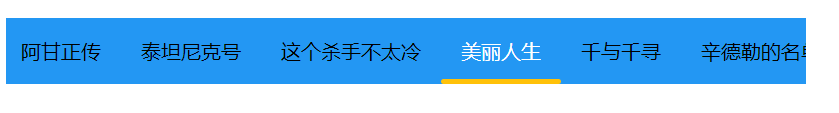
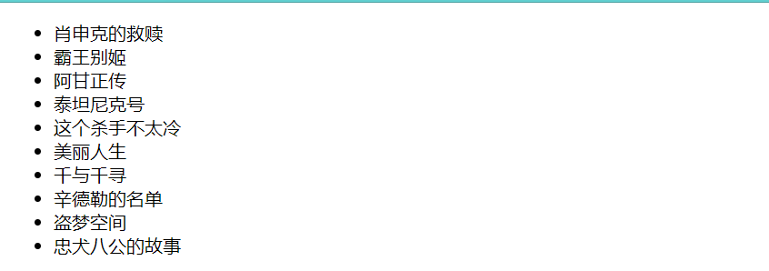

## Preface
Not long ago, in one of my projects, I need to show a horizontal scrolling tab, which supports horizontal mouse drag and click to switch. In the process of realization, I found that this small feature needs to use the front-end of the three carriages at the same time, but the realization of the difficulty is not high, and the final result is not bad, is a rare beginner project, so the idea of writing this article was born, I hope that beginners can help. At the same time, in order to avoid beginners to learn the framework, I intend to use a purely native way to realize it.

Our final result should be similar to the following:

## Requirements analysis
Requirements analysis is to refine the functions we need to complete, the completion of a certain function requires the participation of which technology. For beginners, requirement analysis is crucial, it can help us clarify our thoughts and find a breakthrough to solve the problem, so it should be given enough attention. Taking the goal of this article as an example, the requirement analysis of the tab page can be like the following:

1. the main body of our display is the tab page, HTML is the main technology to achieve the main body;
2. tabs need to be able to drag and click, which involves listening to mouse events and processing, is the home of JS;
3. since the tabs can be dragged, is it necessary to hide that ugly scrollbar, add an activity indicator, and give the mouse a different style? Obviously, these are the strengths of CSS.

As above, through the display, operation, style of the division, we further clarify the HTML, JS, CSS need to complete the work, and even the realization of the clear, so the more detailed the demand split, the more control over the implementation.

## Basic framework
For the front-end, HTML is always the source of everything, so a word first construct a standard HTML page is always right. For demonstration purposes, I've put everything in one HTML file with the following structure
```html
<!DOCTYPE html>
<html>
<head>
	<meta charset="utf-8">
	<meta name="viewport" content="width=device-width, initial-scale=1">
	<title>Tab Demo</title>

	<!-- This is the style area where the subsequent css code will be added. -->
	<style type="text/css">
		
	</style>
</head>
<body>
	<!-- This is the page area where the subsequent HTML code will be added to -->
</body>
<!-- Here is the script area, the subsequent JS code will be added here, placed here because of the convenience of writing code -->
<script type="text/javascript">
	
</script>
</html>
```
Here, unlike in the past, I've put `script` at the end, this is because I want the page tag to be directly available when writing the script, reducing complexity by listening to the page load.

## Implemente the basic function
With the basic structure, the next step is of course to draw the page. It is not difficult to see from the effect of the picture, the page mainly consists of a tab, for HTML, this is not a list of it. So, the breakthrough appeared, we first to the HTML inside the list added
```html
<ul>
		<li>肖申克的救赎</li>
		<li>霸王别姬</li>
		<li>阿甘正传</li>
		<li>泰坦尼克号</li>
		<li>这个杀手不太冷</li>
		<li>美丽人生</li>
		<li>千与千寻</li>
		<li>辛德勒的名单</li>
		<li>盗梦空间</li>
		<li>忠犬八公的故事</li>
</ul>
```
So we had the original tabs. But the tabs were vertical and had ugly little black dots that didn't fit the bill.

Having identified these problems, the next step is of course to solve them, which is of course the strong point of CSS. The first problem is to make the list horizontal. The first problem is getting the list to go sideways, which changes the relative position of the elements, and corresponds to the layout function of CSS. Speaking of layout, there are a number of CSS layout methods, such as `float`, `position`, and so on. Tabs are arranged horizontally in close proximity, one next to the other, so of course you use `flex`. As for the pesky little black dots, this is something new and I need to look it up. I found that `ul` has an attribute `list-style-type`, just set it to `none` to get rid of the black dots.
At this point, all the tabs on the page are tightly aligned. To make it more like a tab, you need to center it, limit the width, add a background color, and add some padding. here's the code after changing the style
```css
ul{
	display: flex;
	justify-content: center;
	align-content: center;
	list-style-type: none;
	background-color: #2397f3;
	width: 600px;
	overflow-x: scroll;
}

li{
	padding: 16px;
	flex-shrink: 0;
}
```
There are two things worth noting. In the `ul` style, because of the width constraints placed on the `ul`, it goes outside the content area, so add the `overflow-x` attribute to the `ul`. Also due to the width, the `flex` child item will shrink by default if the width is not enough, which is shown on the label as the text line break, `flex-shrink: 0;` is to let the child item retain its original size. At this point, refresh the page again, you can see the basic shape of the tab has come out. It's rudimentary, but you can drag the scrollbar to scroll left and right. Next, our goal is to remove this ugly scrollbar. Search online, found that Firefox, IE and Chrome are not the same way, for compatibility, we will write to all.
```css
ul{
	scrollbar-width: none; /* Firefox */
	-ms-overflow-style: none; /* IE 10+ */
}

ul::-webkit-scrollbar {
  display: none; /* Chrome Safari */
}
```
After the scrollbar is removed, the UI looks good, but a new problem arises - the tabs don't scroll anymore. Don't worry, the next step is to add mouse dragging functionality.

## Implemente the interaction
In the browser, HTML tags have the ability to listen to system events, and responding to these events allows the page to respond to user actions in real time. Through the combination of different events, you can realize a variety of rich, interesting features, tabs are the same.

The primary function of the tab is to scroll elements with the mouse drag , then, the first task is to listen to the mouse's movement events . But just listen to the movement is not enough, because usually, the user in the left mouse button down before you want to really drag, the left mouse button up after the end of the drag. So, this drag action actually requires a combination of mouse down (`mousedown`), mouse move (`mousemove`) and mouse up (`mouseup`) events. So where and how do you add these three methods?

In the Web API, the entry point for JS to manipulate HTML is the `Document` object, which provides an API for manipulating (adding, deleting, modifying, or changing) HTML elements.There is a standard process for this.
1. Find the target element through `Document`. 2;
2. Perform element and style changes on the target element. 3;
3. Changes are made;

The process is repetitive and tedious, and in order to reduce the need to write such sample code and speed up development, a whole bunch of front-end frameworks have come into existence. So, when learning about front-end frameworks, keeping this basic step in mind will help you quickly understand how the frameworks work. After all, no matter how the framework changes, it is ultimately the process that is implemented.

Once the algorithm is clear, the next step is the concrete implementation.

### Find target element
Before finding the target, it needs to be clear who the target is in the first place. The user certainly doesn't want to drag the mouse elsewhere on the page and have the tab scroll along, which is weird. So our target element should be an unordered list. So, how to know the unordered list through `Document`? Checking the API of `Document`, I found that it has a `querySelector` method, which will find the selector that satisfies the condition from top to bottom and return the first element that satisfies the condition, and the parameter is the name of the selector. We've already made it clear that our target is an unordered list, so the final code to find the target element looks like this
```js
const ul=document.querySelector('ul');
```

### Let the list scrollable
Every HTML element is an `Element` object in JS. In the previous step we have got an `Element` object `ul`, note that the `ul` object here is not exactly the same as the `ul` tag. One is a JS object representation of an HTML tag and the other is an HTML tag. Now that you have an object, you can manipulate that object by calling the appropriate methods. By consulting the `Element` object's API, I found that it has an `addEventListener()` method, which accomplishes listening to certain events for the HTML tag represented by the object. This method takes two parameters, the first of which is the name of the event, as described in the previous section. The second parameter is the handling of this event, and this is where we realize the magic.

First, after the user presses the left mouse button, it starts recording the mouse movement. After the left mouse button is lifted, the logging stops. So the main function of the press and lift is to maintain the logging switch, and the action of controlling the scrolling of the label has to be handled in the mouseover callback.

But before actually writing the logic, there are still two issues that have not been dealt with.
1, how to make the label scroll?
2. How to write the scrolling logic?
Question 1 of course, you need to consult the `Element` API. Searching for scrolling related, I found two methods that are more relevant -- `scrollBy()`, `scrollTo()`, both of them can scroll the content. The only difference is that the former's parameter is the offset of the scroll, and the latter is the final value. Since mouse movement is bit by bit, it's a bit easier to choose the former. Determined the method, but also answered the first question. For question two, it's simply a matter of how to provide the parameters needed for question one. `scrollBy()` takes two parameters, the horizontal and vertical scroll offsets. Since we only want the tab to scroll horizontally, the vertical offset is always 0. What about the horizontal? Usually event callbacks pass an event object called `MouseEvent`, we check the API of the event object and find that it comes with several properties about coordinates - `clientX`, `movementX`, `screenX`. The `movementX` is straight forward for our needs, it represents the offset between the last mouse movement and this one, and it just so happens that `scrollBy()` takes the offset as its parameter, so there you go.
To summarize, this is the following code
```js
const ul=document.querySelector('ul');
let isMouseDown=false;
ul.addEventListener('mousedown',(e)=>{
	isMouseDown=true;
})
ul.addEventListener('mousemove',(e)=>{
	if(isMouseDown){
		ul.scrollBy(-e.movementX,0);
	}
})
ul.addEventListener('mouseup',(e)=>{
	isMouseDown=false;
})
```
As you can see, a negative sign is added to the offset in the handling of `mousemove`. This is because the top-left corner of the HTML page is the coordinate origin, and the right side is the positive direction of the X-axis. If you move all the way to the right, the X coordinate is increasing, and the value of `movementX` is the difference between the current mouse coordinate and the last coordinate point, which must be smaller than this one, so the difference between the two must be positive. For the same reason, a positive value for the `scrollBy()` parameter means an increase in the X value, i.e., it shows the content on the right and hides the content on the left. The effect of combining the two is that dragging the mouse to the right shows the hidden content on the right side of the tab, which is counter-intuitive. Normally we want to drag the mouse to the right to show the left side of the page and hide the right side. Based on this analysis, we need to invert the value of `movementX`.

### Show currently selected tabs
Right now, the tabs are scrollable, but not yet selected. I want a small horizontal bar to appear below a tab when I click on it to indicate the selected state. Obviously, displaying the little bar is a CSS issue, and clicking on the tab to toggle the little bar is a JS issue, so this time we need to deal with both JS and CSS.

First of all, let's display the small bar. There are two ways to do this, one is to have a `div` tag in the HTML, the other is to use a `::after` pseudo-element. I chose the latter, which keeps the HTML clean.
Next you need to style the little horizontal bar
* Overlay on the selected tag
* Positioned at the bottom of the tag
* As long as the label

We know that normal HTML document flow is left-to-right, top-to-bottom, with newly added elements appending to the right or bottom of existing elements. The small horizontal bar needs to be overlaid on the tag, so this default behavior has to be changed, and the `position` attribute is the key to making this happen. The `absolute` and `fixed` attributes can be used to break out of the normal document flow and cause an element to overlay an ancestor element, the difference being that the former is relative to the closest positioned ancestor, while the latter is the viewport equivalent. The small horizontal bar follows the label display, so obviously the former should be used. Having determined the position, there is also the size and style. Since we're using absolute positioning, `bottom`, `left`, and `right` define its position and size accordingly, and we'll just use `border-bottom` for the style of the little bar. So, the style of the small bar is confirm now
```css
.current::after{
			content: "";
			position: absolute;
			border-bottom: 4px solid #FFC109;
			border-radius: 2px;
			bottom: 0;
			left: 0;
			right: 0;
}
```
Is it over, not yet! When you use absolute positioning, you must always remember to find an anchor point, or reference, for the absolutely positioned element, otherwise `top`, `left`, `right`, `bottom` to refer to whom? So how do you tell the absolutely positioned element what to refer to, it's the `position` attribute. Only this time it's going to be inside the CSS of the reference. And from the previous styling analysis, the little horizontal bar always follows the tab, which means the reference for the little horizontal bar is the tab. So, there's also the `position` attribute to add to the tab's style. And of course, I changed the color a bit to make the distinction more obvious.
```
.current{
			color: white;
			position: relative;
}
```
At this point, the small horizontal bar can be displayed normally.

### Small horizontal bar following mouse clicks
With the experience of the previous drag-and-drop functionality, this time it's a breeze. When the mouse clicks on a tab, a small bar is displayed below the corresponding tab. This time the object of the event is a single tab, so the click event is added to a single tab. But this time there are too many tabs, we can't follow the previous Find-Set method, it's too cumbersome. Coincidentally, we've already got the `ul` object, and with its `children` property, we can get all the `li`s.
The little bar has to be switched to a different tab, which means that the style of the little bar has to be dynamically added or removed depending on who is clicking on it. Checking the `Element` API, I found that there is a `className` property, change its value to increase or decrease the style.
```js
let last=null;
for(let l of ul.children){
		l.addEventListener('click',(e)=>{
			if(last){
				last.className='';
			}
			e.target.className='current';
			last=e.target;
	})
}
```
The implementation of the code has an extra `last` object. Because normally only one tab can be selected at a time, when a new tab is selected, the last selected tab should be restored to its original style, which is what the `last` object does. We uncheck the last element first, and then check the currently clicked object, which completes the effect of the small horizontal bar following the clicked selection.
## Summary
Overall, the difficulty of this project is not how hard it is to implement, but how new it is. Many beginners, in the face of such new problems are often helpless and can not find the entry point. This article tries to analyze the requirements, disassemble the problem, refine the methodology and finally solve the problem in the form of an example with a beginner's mindset. Starting from the most simple intuition, it guides the thinking to find a way that is easy to accept and understand.

Therefore, do not panic when encountering a new problem, after the problem is disassembled, see if you can find a breakthrough, if you can not find, and then look for inspiration from the several main objects involved, usually will have some gains. Last but not least, visit MDN more often, it can really come in handy at critical moments.

Finally, Happy Valentine's Day, and may all lovers be united in love!

参考

- [1] [使用CSS隐藏元素滚动条](https://www.cnblogs.com/jofun/p/11158145.html)
- [2] [Element](https://developer.mozilla.org/zh-CN/docs/Web/API/Element)
- [3] [Events](https://developer.mozilla.org/zh-CN/docs/Web/Events)
- [4] [MouseEvent](https://developer.mozilla.org/en-US/docs/Web/API/MouseEvent)