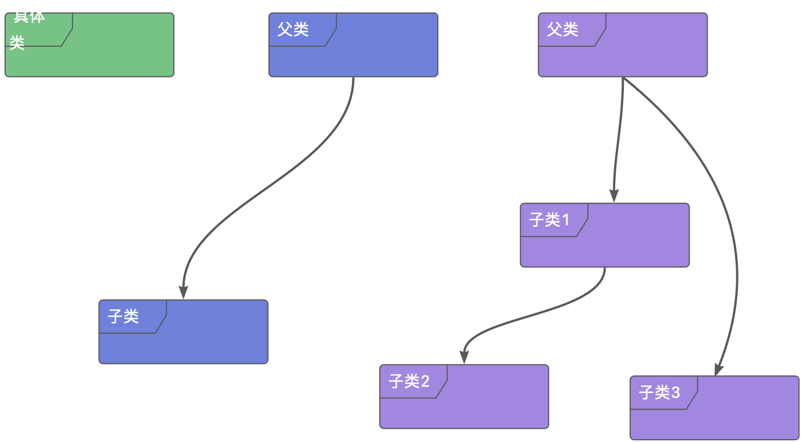

> Classes, one of the important concepts in C++, have numerous features and are the most fascinating part!

Class is a processing plant, developers use C++ to provide a variety of materials to assemble the factory, so that it can produce data to meet their own requirements, through the transformation of the factory, you can finely control the object from birth to death of the various behaviors, to truly achieve the realm of my code I'm in charge.

## Class
The three main object-oriented features we often talk about: encapsulation, inheritance and polymorphism, actually speak of an abstract dimension. The simplest is the concrete class, which packages data together and provides functions to manipulate the data, making it no longer necessary for the developer to pass data in the form of passing parameters. It realizes the abstraction of things, also known as encapsulation. The second layer is to extract the commonality in a bunch of data as a base class, and then the characteristics as subclasses, making full use of the advantages of inheritance to realize code reuse. It pursues not only data abstraction, but also behavioral similarity. And furthermore, a set of algorithms do not care about the actual data, only care about what it can be used to complete the work, and even each other do not know each other's existence, the only common point is that they are all inherited from a certain class, they can complete the operation specified by that class, as for the details do not care about it, this is polymorphism, the class is just a kind of specification process. From the first layer to the third layer, the abstraction of things from the concrete to the abstract, the focus also shifted from data to behavior, just for better maintainability and decoupling. The relationship between the three might look something like the diagram below:

In order to make sense of the more advanced inheritance and polymorphism, in this post we will focus on their first form: encapsulation, or concrete classes.
## The basic components of a class
A class is a custom type that consists of two main parts: member variables that hold the data managed by the class and member functions that manipulate the data.

The biggest difference between a member variable in a class compared to a regular variable is its life cycle. A member variable does not take up space until the class is instantiated, and the constructor completes its initialization. After the construction is complete, the member function can use the member variable without restriction until the destructor is called.
The difference between a member function and an ordinary function is that the member function has an implicit `this` pointer, which points to the location where the member variable is stored, i.e., access to the member variable can be easily accomplished.

As you can see, the main body of concrete class research is data. Next I'll finish parsing the class characteristics around the life cycle of the data.
## Object creation and destruction
The first major role of classes is to control how they are generated and destroyed. Unlike Java, there are constructor calls involved without using `new`, even if it's just a normal local variable, out of the variable's scope, the object is destroyed and memory is freed.
```cpp
class Sample{
 public:
    Sample(){
        std::cout<<"Creating a Sample object"<<std::endl;
    }
    
    ~Sample(){
        std::cout<<"Destoring a Sample object"<<std::endl;
    }
};

int main(){
    // Sample's constructor is called
    Sample a; 
    {
        // The curly braces create a local scope, and the object b exists only within the curly braces; out of the curly braces, b is destroyed, and Sample's destructor is called.
        Sample b;
    }
    // At this point, only object a is alive
}
// output
// Creating a Sample object
// Creating a Sample object
// Destoring a Sample object
// Destoring a Sample object
```
The above Sample is the simplest class definition, we have created only the constructor and destructor of the class and in the `main` function, two variables are created. By examining the output, we can be sure that both the constructor and destructor of the class have been called.
The class above is functionally useless, we can do nothing but create an object of it and watch it die. Next, let's revamp the `Sample` class so that it can tell us which object is being constructed at the time of construction.
```cpp
class Sample{
    Sample(const std::string name){
            std::cout<<"Creating a Sample object:name = "<<name<<std::endl;
        }
    //the rest remains unchanged
};

int main(){
    // Since a string object is used to create object a, you have to create a string object first
    std::string str{"a"};
    // At this point the constructor class needs a name now that we have control over the initialization state of the class
    Sample a{str}; 
    {
        // Sample's only constructor requires a string object, but the compiler assumes that the type of argument passed to Sample's constructor is a string constant.
        // The parameters don't match, but that's not a failure because the compiler hasn't checked to see if there's a constructor that generates a string object from a string constant.
        // The answer is yes, the string class provides such a constructor.
        // The compiler then constructs the string object from the string constants, which automatically creates the string object
        // and passes it to Sample's constructor. The condition is met, and the compilation completes successfully.
        Sample b{"b"};
    }
}
// output
// Creating a Sample object:name = a
// Creating a Sample object:name = b
// Destoring a Sample object
// Destoring a Sample object
```
One noteworthy thing about the above example is that the object `b` is created directly from the string constants, omitting the intermediate string object, which is actually done for us by the compiler, and is created in exactly the same way as `a`, a behavior known as implicit conversion.

At this point the `Sample` class still can't do anything, we don't even know which object was destroyed. A destructor is a function, so is it okay to add parameters to a destructor? The answer is no, because the compiler automatically calls the destructor for us, and it doesn't know what parameters are needed to call it, so it can only be unparameterized. So what's the best way to mark which object has been destroyed? The answer is a member variable.

A member variable lives and dies with the object; it uses the same block of memory as the object. When the object is created, space is also allocated for the member variable, but it is not initialized and needs to be initialized by the developer before it is used by the constructor or other functions. At the time of the destructor call, the memory has not been reclaimed and this is the last time to use the member variable. Another important feature of member variables is that they can be used by all non-`static` functions defined in the class, and do not need to be passed through function parameters. This is one of the original purposes of class design, to manage data with classes.
So, the next destructor function could be written like this
```cpp
class Sample {
private:
    // Step 1:Creating a member variable
    std::string name;
public:
    // Step 2:在构造函数中初始化成员变量
    Sample(const std::string name) :name{ name } {
        std::cout << "Creating a Sample object:name = " << name << std::endl;
    }

    ~Sample() {
        //Step 3:Use the member variable
        std::cout << "Destoring a Sample object:name = " << name << std::endl;
    }
};

int main() {
    std::string str{ "a" };
    Sample a{ str };
    {
        Sample b{ "b" };
    }
}
// output
// Creating a Sample object:name = a
// Creating a Sample object:name = b
// Destoring a Sample object:name = b
// Destoring a Sample object:name = a
```
As you can see, creating member variables is also very simple, the key is in the second step, which is again different from Java. In the second step, a special syntax is used to initialize member variables, adding `:` after the constructor parentheses, and then the syntax for normal variable initialization, called member variable initialization. The key reason for this is that the creation of the object needs to apply for memory first, and after the memory is applied for, the member variables are initialized using the initialization method after the `:`, and finally the constructor is called to complete the creation of the object, and each step has its corresponding position and role. If you write it inside the constructor as Java does, you're putting the second step into the third step and disrupting its original order.
In order to show that member functions can indeed be used throughout the life cycle of an object, let's add another member function to it.
```cpp
class Sample{
    void print() {
        std::cout << "Invoke print name = " << name << std::endl;
    }
    //the rest remains unchanged
}
int main() {
    std::string str{ "a" };
    Sample a{ str };
    {
        Sample b{ "b" };
        b.print();
    }
    a.print();
}
// output
// Creating a Sample object:name = a
// Creating a Sample object:name = b
// Invoke print name = b
// Destoring a Sample object:name = b
// Invoke print name = a
// Destoring a Sample object:name = a
```
We added a member function `print` which has no arguments, but it uses the member variable `name` for its function body, and as you can see, it works just fine.
This pretty much covers the creation and destruction of objects. What hasn't been mentioned yet is that there can be many constructors, and you can choose which one to use when creating an object. The compiler will derive the actual constructor to use based on the parameters passed, and all the developer needs to consider is that the constructors provided do the correct initialization of the member functions, so that when they are called, the member functions will all work as expected. As in the case of `Sample`, we can also provide a constructor with no parameters and then initialize `name` to the empty string so that the `print` and destructor functions also work properly.

To summarize, a class is a container that manages data that is created with the creation of the object and is available throughout the life cycle of the object's existence. The constructor needs to ensure that the data is initialized and can control the way it is constructed, the member functions can be used at any time, and the destructor is the last call when the object is destroyed, and it needs to ensure that the data is cleaned up to this point.

## Transfer and sharing of data
### data copy
After the data is created, it is not only available for use by member functions, but may also be transferred to other objects. Or shared with other objects. The copy constructor controls the way in which the data is shared with other objects.
```cpp
class Sample {
private:
    int value;
public:
    Sample(const int value) :value{ value } {
        std::cout << "Create value = " << value << std::endl;
    }

    // Named after Sample, it is a constructor, and the function argument is its own type, indicating that it is a copy constructor
    // The function returns and the sample object is destroyed
    Sample(const Sample& sample) :value{ sample.value } {
        std::cout << "Copy create object" << std::endl;
    }

};

void use(Sample sample) {
    //The function returns and the sample object is destroyed
}

int main() {
    Sample a{ 1 };
    // The data for a has been shared with a temporary object, and there are now two objects, both of which have a value of 1.
    use(a);
}
// output
// Create value = 1
// Copy create object
```
The copy constructor has the following characteristics

1. There will be at least two objects of the same type. This is because copying requires an existing object first, and then initializing the member variables of the other object being created with the data of this existing object. This is also the reason why the argument of the copy constructor is itself.
2. The copy constructor is called in all cases where an existent variable is initialized from nothing. Function calls, the formal parameter needs to be initialized to a real parameter, the parameter does not exist, the call function will be passed a pre-existing object, the copy constructor will be called. This is why copy constructor arguments are of reference type. If it is an ordinary variable, the call to the copy constructor needs to generate a temporary variable, the temporary variable needs to call the copy constructor, the program will be stuck in infinite recursion.
3. In addition to function calls, function return values, the initialization of new variables with objects will also call the copy constructor. After the function returns, all local variables in the function body will be destroyed, the return value also belongs to a kind of local variables must also be destroyed, but after the return value needs to be used by the external, their life cycle is not the same, from which we know that a new object must be created, this object is initialized by the local return value, but has the same life cycle as the external. Initializing a variable with an object is even more intuitive; the initialized object is created from nothing. This is consistent with the emergence of constructors.

We can verify this.
```cpp
//the rest remains unchanged
Sample returnSample() {
    // Initialized with the normal constructor
    Sample sample{ 2 };
    return sample;
}
int main() {
    Sample a{ 1 };
    std::cout << "init local variable" << std::endl;
    // b is a new object, initialized with a, so the copy constructor is called
    Sample b = a;
    // The form parameter of use is used to initialize the
    std::cout << "Use Sample as parameter" << std::endl;
    use(a);
    //The returned sample is used to initialize c
    std::cout << "return sample" << std::endl;
    Sample c = returnSample();
}
// output
// Create value = 1
// init local variable
// Copy create object
// Use Sample as parameter
// Copy create object
// return sample
// Create value = 2
// Copy create object
```
As you can see, all three cases result in a copy constructor call.
### Data Move
Data copying is simple and easy to do, but there is still a small flaw. Consider a scenario like the following:
```cpp
void swap(Object& left,Object& right){
    // A new object is created, a copy is constructed, and there are now two identical copies of left in memory.
    Object temp=left;
    // The assignment operation generates a temporary object of right
    left=right;
    // The assignment operation generates a temporary object of temp
    right=temp;
    // All three temporary objects are destroyed
}

int main(){
    Object a;
    Object b;
    swap(a,b);
    return 0;
}
```
A simple swap logic, we generate a lot of temporary objects, if we operate a list, large objects, a large number of short time to create and destroy the object, it will cause memory jitter, serious impact on the stability of the system, and, our real purpose is just to swap the value of two variables. So compared to copying, we have a better option: moving.
#### Left and Right Values
Talking about moves, we have to mention left and right values. Here left and right are relative to `=`.

We know that `=` is used to assign values, and there are three actions hidden underneath this: generate, fetch, and write. Generate a temporary data in memory, read the variable save location, and write the contents of the temporary variable to the save location. Generate refers to the right value, which is stored in a memory location we don't know, and is recycled after the write action is completed. And fetch corresponds to the left value, we save its memory location with the name of the variable, and it can be read and written repeatedly within its scope. So the best thing about right values is that they don't know the address, e.g. `i=i+1` will be first generated as a temporary object of `i+1`, we don't know the address, so it's a right value. In contrast, a left value can be read by `&`.

Next, let's talk about references. We usually think of references in terms of aliases, but we may have overlooked the small detail that an alias also needs to be attributed, i.e., where the address it represents is located. Based on this premise, we can deduce that any data that exists in memory, the reason is that there is an address, and the right value is present in memory, it should also need a way to get the address, called the right value of the reference, as opposed to the general reference to the variable is called the left value of the reference.

Going back to moving, while the previous copy constructor shares data with other objects, in most cases the data doesn't really need to be shared, it just needs to be transferred, that is, the ownership of the data is moved to another object and the original object is no longer valid. So C++ provides move constructors to accomplish this.
```cpp
class Sample {
private:
	int* value;

public:
	Sample(const int value) :value{ new int{value} } {
		std::cout << "Create value = " << value << std::endl;
	}

	Sample(const Sample& sample) :value{ new int {*sample.value} } {
		std::cout << "Copy create object" << std::endl;
	}

	Sample(Sample&& sample) :value{ sample.value } {
		sample.value = nullptr;
		std::cout << "Move create object" << std::endl;
	}

	~Sample() {
		delete value;
		std::cout << "destory sample" << std::endl;
	}

	friend std::ostream& operator<<(std::ostream& os, const Sample& sample) {
		os << "Sample value is " << sample.value;
		return os;
	}

};

void use(Sample sample) {
	std::cout << "Use sample " << sample << std::endl;
}


int main() {
	// Ordinary variable, 1 is destroyed immediately after it is used.
	int a = 1;
	// left reference
	int& b = a;
	//Right-valued references, referencing the address of the temporary storage of 1
	int&& c = 1;
	//The value of a reference can be modified
	c = 2;

	Sample sample{ 1 };

	use(std::move(sample));

	std::cout << sample << std::endl;
}
// output
// Create value = 1
// Move create object
// Use sample Sample value is 009B8E90
// destory sample
// Sample value is 00000000
// destory sample
```
In the code above, we're really using the `sample` object in the function `use`, and after `use` is executed, `sample` is useless. So we used `std::move` to move the data into the function's real parameters, and the external `sample` no longer has that memory footprint. A lot of scenarios are actually similar: an external configuration parameter is passed to a function to use, so there's no need to construct a new object in this case, and if the business is very long, the `sample` object will keep taking up memory, but it's long gone. That's why the mobile constructor is so useful.
### data sharing
In addition to sharing data through copying constructors and member functions, you can also share data through friend classes and friend functions. They are both a special form of accessing data that can be accessed directly without going through member function calls. So there are times when friending can help reduce the expense of function calls and other times when it can introduce unanticipated behavior.
```cpp
class FriendClass {

public:
    void useSample(const Sample& sample) {
        std::cout << "Sample value is " << sample.value << std::endl;
    }
};
```
The above example would not compile as usual, because the `value` of `sample` is private. As we know, member functions can access private variables, but this class is defined outside of `Sample`, and this function is a member function of another class, so there's no way to accomplish this access at all. Of course, in this case, we can modify the definition of the `Sample` class and add a member function to solve the problem. But what if `FriendClass` has more than one member function that needs to access private members of `Sample`, then adding a member function no longer applies, hence the friend class.

Implementing a friend class is simple, so simple that you only need to add one declaration. First of all the friend class needs at least two classes, one class is the source class which wants to access the private members and the other is the target class which contains the private members, then we put the friend declaration in the target class and the source class can access the private members of the target class without any problem. In the above example `FriendClass` wants to access the private members of `Sample`, so it is the source class, which is the ordinary class. `Sample` contains the private member `value` that `FeiendClass` wants to access, so it is the target class and the declaration needs to be added to its class definition.
```cpp
Class Sample{
    private:
    int value;
    friend class FriendClass;
    
    //the rest remains unchanged
}
```
After adding this clause, the preceding `FriendClass` will pass compilation normally. The power of this sentence is so great that all member functions of `FriendClass` have access to `value`. If this is not what you expect, but you still want direct access to `value`, then you can apply a friend function.
A friend function is an ordinary function that, although declared in a class, does not have direct access to the private members of the class, but rather in the form of function arguments. In order to distinguish it from ordinary member functions, the keyword `friend` needs to be added at the top of its declaration. `friend` is like flipping a permission control switch that allows the function to access the private members of its arguments.
```cpp
class Sample{
    friend std::ostream& operator<<(std::ostream& os,const Sample& sample) {
        os << "Sample value is " << sample.value << std::endl;
        return os;
    }
    //the rest remains unchanged
}

int main() {
    Sample a{ 1 };
    std::cout << a << std::endl;
}

// output
// Create value = 1
// Sample value is 1
```
The function `<<` is a friend function because the function declaration has the keyword `friend`. A friend function is not a member function. To access a member variable in the body of a function, you need to add a function parameter. So there are many function parameters, how to determine the accessibility of the private members of the parameter, it depends on which class the friend function is declared in, the location of the declaration of the friend function directly determines the scope of its access to private members.
## Special Member Functions
C++ classes have a great deal of customization, and this customization is not just in the data, but also in the member functions. We know that normal member functions are called using `. `, but for specific scenarios, there are cases where this form of calling is not only unintuitive, but also inefficient. That's why C++ introduced the concept of operators. They are called operators because functions are called and passed differently than normal member functions. Well-defined operators can greatly improve the readability of your code. For example

- The `[]` operator is a subscripting operator, with the help of which we can take elements of a container like `obj[2]`.
- `()`, on the other hand, can be called directly on an object as if it were a function, realizing the effect of functional programming.
- `->` can return another object, allowing it to exhibit the behavior of another object.

There are other operators such as `++`, `--`, etc. Providing the right operator functions when defining a particular type of class can make our classes more concise and usable.
## Summary
In a nutshell, the class is a data manager, and the constructor controls the generation of data from either other types or the same type. When generating new data with the same type, there are two options: copy and move. The copy constructor controls the data sharing behavior of the same type, and its main goal is to realize that the two types have the same data in memory at the moment the constructor finishes. The goal of the move constructor, on the other hand, is to transfer existing data to the currently constructed object and then invalidate the existing data, thus achieving the goal of reducing object creation and destruction and increasing memory utilization. In addition to this, member functions can be used to change or access the data, and eventually end the life of the data in the destructor. In addition, a friend class or a friend function is also a way to access data.

The main conflict in concrete classes is data, and the key to designing classes is still figuring out where the data flows. What state the data itself can have internally and what behavior it can achieve is the work that member functions should accomplish. In addition to consider the sharing of data when the same type constructs each other, whether it is completely isolated, or affect each other, these are all issues that should be considered. After all, to ensure the reliability and validity of the data from creation to destruction is a concrete class should accomplish the basic function.
