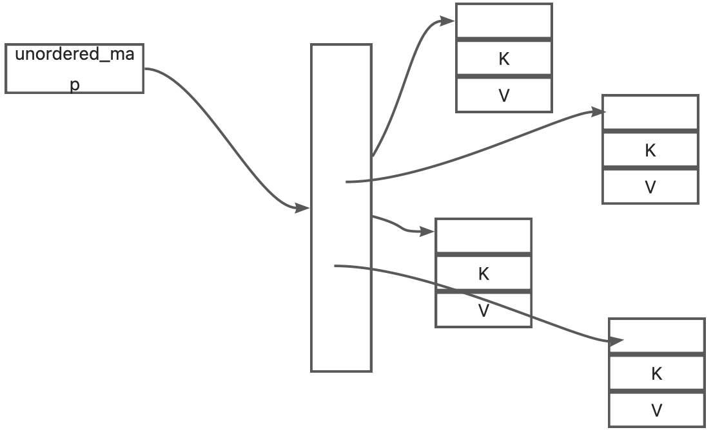

> 在[上一章](https://www.yuque.com/docs/share/adb5b1e4-f3c6-46fd-ba4b-4dabce9b4f2a?# 《现代C++学习指南-类型系统》)我们探讨了C++的类型系统，并提出了从低到高，又从高到低的学习思路，本文就是一篇从高到低的学习指南，希望能提供一种新的视角。

## 什么是标准库
编程语言一般分为两个部分，一部分是语法部分，如上一章的类型系统，另一部分则是用这套语法完成的预定义的工具集，如本文的主题——标准库。标准库是一堆我们写代码时直接可以用的代码，就像是我们提前写好的一样，不仅如此，标准库还是跨平台的，还是经过工业级测试的，所以标准库有着靠谱，安全的特点。
C++标准库包括很多方面，有类`vector`、`string`等,有对象`std::cin`，`std::cout`等，还有函数`move`，`copy`等，所以一般按功能来对它们分类

- 容器类
- 算法类
- 智能指针
- 线程相关
- 其他

当然，这些还不是全部，标准库是在不断扩充和完善的，学习标准库的宗旨也应该是学习它们的使用场景，而不是深入用法。比如容器类中就有很多功能类似的类，不同的业务场景有不同的选择。通过对它们的了解，我们更容易写出高效，简洁的代码。
## 容器类
容器类就是帮助管理一组数据的类，根据实现方式的不同，分为有序列表，无序列表和映射。
有序列表中的有序是指，数据组保存在一块连续的内存区域里，可以通过插入时的索引直接定位到原数据。因为数据是按顺序存入的，所以中途假如需要删除或者新增数据，在操作位置右边的数据都需要移动，操作的代价就比较大。由此也可看出它们的优势是顺序插入和尾部修改，还有直接查找，这方面的代表就是`array`，`vector`。
`array`是对原始数组的封装，并且解决了传递数组变成指针这样的问题，但是缺点是它的大小是固定的，适合用在数据量已知的情况。而`vector`又是对`array`的增强，不仅能完成所有`array`的操作，并且大小可变，所以绝大部分情况下，选择`vector`都是理想的选择。

无序列表的元素是单独存储的，相互之间用指针来查找相邻元素，由于指针可以轻易修改指向的指，所以对相邻元素的修改就变得很快捷。同样的道理，查找相邻元素只能靠指针跳转，查找某个值需要从一个指针开始查找，一次跳转一条数据，直到找到目标或者没有数据为止。所以无序列表的优势是快速地删除和插入新数据，不适合查找，其代表有`list`，`forward_list`。显然，有序列表和无序列表是互补的，我们在实际项目中，应该**根据数据的操作来确定选择哪种容器。**


**映射则融合了有序列表和无序列表的优点，既可以快速插入和删除，又可以快速查找**。为了满足各种使用场景，C++提供了`map`，`multimap`，`unordered_map`，`unordered_multimap`。从名字上就能看出来它们的差别。为了直观，我直接列了一个表

|  | 是否排序 | 是否支持相同值 | 速度 |
| --- | --- | --- | --- |
| unordered_map | ❌ | ❌ | ❤️❤️❤️❤️ |
| map | ✅ | ❌ | ❤️❤️ |
| multimap | ✅ | ✅ | ❤️ |
| unordered_multimap | ✅ | ✅ | ❤️❤️❤️ |

映射存储的是两个值，不同的类型实现方式不一样。由于`map`是需要排序的，所以通常它的实现是一种平衡二叉树，键就是它排序的依据。

而`unordered_map`是不需要排序的，所以它的实现通常是哈希表，即根据哈希函数的确定索引位置继而确定存储位置。

综上，容器类提供了一种操作多个同类型数据的接口，开发者通过对容器类方法的调用，可以实现对容器内数据的增删改查。大部分情况下，`vector`都是靠谱的选择，它提供了全功能的数据操作接口，支持动态长度，索引查询，并且简单高效。如果需要频繁地插入或者删除操作，也可以考虑`list`或者`forward_list`。`map`可以让数据保持有序，需要更快的速度而不是排序的话`unorderer_map`是更好的选择，如果相同值会出现多次就可以使用对应的`multi`版本。另外容器类也是很好的数据结构学习资源，C++的容器类几乎提供了数据结构中所有的形式，对数据结构越熟悉选择的容器类就越完美。
## 算法
之所以将算法放在容器类后面，是因为算法大部分是对容器类操作的加强，算法都定义在`algorithm`文件头里。这些算法都是短小精悍的，可以大大增加代码可读性，并且妥善处理了很多容易遗忘的边界问题。功能上可以分为增删改查几种操作，可以在实际有需要的时候在查看文档，具体可以参阅[这里](https://cplusplus.com/reference/algorithm/)
## 智能指针
很早以前，我对智能指针的态度不是很好。因为刚开始学习C++时我就知道，不能单独使用指针，要把指针封装在类里，利用类的构造函数和析构函数管理指针，也就是`RAII`。最开始我以为这就够了,直到我遇到下面这种情况
```cpp
public:
    Ptr():p{ new int } {}
    ~Ptr() {
        delete p;
    }
    int& get() {
        return *p;
    }

    void set(const int value) {
        *p = value;
    }
private:
    int* p;
};

void use(Ptr p) {
    //传进来的是复制构造出来的p',函数返回后p'被销毁啦，两个指针指向的地址被回收，外面的p指针成为了野指针
}
int main() {
    Ptr p;
    p.set(1);
    use(p); //p按值传递，调用了Ptr的复制构造函数，构造出了新对象p',它的指针和p的指针指向同一个地方
    std::cout << p.get() << std::endl; //p已经被销毁了，访问p的地址非法
    return 0;
}
```
调用`use`时，变量`p`被拷贝，也就出现了两个指针同时指向一块内存地址的情况。`use`函数执行完后，它的参数`p`被回收。也就是调用了`Ptr`的析构函数，也就是两个指针指向的地址被回收。所以24行调用`get`读取那个已经被回收了的地址就是非法操作，程序崩溃。
这可能是新手比较常遇到的一个问题，当然，解决这个问题也很简单，还用不到智能指针，只需要将函数`use`的参数改为引用类型就可以了，因为引用只是别名，不会产生新的指针，这也是我在类型系统篇中极力推荐引用为首选参数类型的原因之一。对于此例，数据不大，直接重写复制构造函数，重新申请一块内存也是一种思路。
此例中用到Ptr的地方只有一个，实际项目中Ptr往往需要用到很多次，我们不能保证不会出现忘记使用引用类型的情况，这种情况下重新申请内存也不适用，所以这个时候就需要智能指针来帮忙了。
现在思考另一种情况，某些操作我们不得不暴露出我们的指针供外部使用，随着业务的嵌套和调用链增加，很多时候会忘记或者不确定在什么时候调用`delete`释放内存。这也是用智能指针的一个场景。以上两种情况都是需要分享指针，对应智能指针中的`shared_ptr`。
`shared_ptr`顾名思义，它可以帮助开发者完成指针共享的问题，并且完美解决提前释放，不知何时释放，谁负责释放的问题。它的对应关系是一对多，一个实际的内存可以被多个`shared_ptr`共享

另外一种场景是我们希望**自始至终某个指针某个时刻只属于一个对象**，外部想要使用它要么通过拥有该指针的对象方法，要么把指针的所有权转移到自己身上，这种场景对应智能指针中的`unique_ptr`。

`unique_ptr`的对应关系是一对一，无论哪个时刻，只能有一个管理者拥有指针，也就只能由它负责释放了。假如想转移这种对应关系，只能通过`std::move`操作，不过这个操作之后，原先对象的指针就失效了，它也不再负责管理，所有的任务移交给了新的对象。这种特性特别适合资源敏感型的应用。
## 线程库
除了内存，线程是开发中另一个重要的课题。线程的难点在于不仅要管理线程对象，还要管理线程对象管理的资源，并且保证线程间数据同步。当然标准库已经做得足够好了，我们需要理解的是使用场景的问题。线程库主要包括线程对象`thread`，条件对象`condition_variable`，锁对象`mutex`。
使用`thread`可以很方便地把程序写成多线程，只需要三步：
```cpp
void plus(int a,int b){ //第一步：定义线程中要运行的函数
    std::cout<<"running at sub thread"<<std::endl;
    std::cout<<"a + b = "<<a+b<<std::endl;
}

int main(){
    std::thread thread{plus,1,1}; //第二步，定义std::thread对象，将函数作为参数
    std::cout<<"continue running at main thread"<<std::endl;
    thread.join(); //第三步调用线程对象的join函数或者detach函数
    std::cout<<"sub thread finished!"<<std::endl;
}
//输出
//	continue running at main thread
//	running at sub thread
// 	a + b = 2
// 	sub thread finished!
```
难点在线程间通信，也就是解决两个问题

1. 线程1更新了变量v的值
1. 线程2马上能读取到正确的变量v的值，即线程1更新的那个最新值

为了协调这两个过程，就出现了锁对象`mutex`和条件对象`condition_variable`。锁对象`mutex`保证变量按照正确的顺序更改。条件对象`condition_variable`保证更改能被其他线程监听到。
```cpp
int a,b;
bool ready = false;
std::mutex mux;
std::condition_variable con;

void plus() {
    std::cout << "running at sub thread" << std::endl;
    //因为我们要读取ready的最新值，所以要用锁保证读取结果的有效性
    std::unique_lock<std::mutex> guard{ mux };
    if (!ready) {
        //数据没准备好，休息一下！
        con.wait(guard); 
    }
    //这里就可以正确读变量a,b了
    std::cout << "a + b =" << a + b << std::endl;
}

int main() {
    std::thread thread{ plus};
    std::cout << "continue running at main thread" << std::endl;
    std::cout << "input a = ";
    std::cin >> a;
    std::cout << "input b = ";
    std::cin >> b;
    {
        //数据准备好了，该通知子线程干活了，用大括号是因为想让锁因为guard的销毁即使释放，从未保证plus里面能重新获得锁
        std::unique_lock<std::mutex> guard{ mux };
        //更新数据
        ready = true;
        //通知
        con.notify_all();
    }
    thread.join();
    std::cout << "sub thread finished!" << std::endl;
}
```
多线程另一个需要注意的问题就是死锁。死锁的前提是有两个锁

1. 线程1得到了锁a，还想得锁b
1. 线程2得到了锁b，还想得锁a

然后，再加上一个前提：某一时刻，只有一个线程能拥有某个锁，就不难得出以下结论：线程a，b除非某一个放弃已得的锁，不然两个线程都会因为没得到需要的锁而一直死等，形成死锁。同时解决死锁的思路也呼之欲出：既然一个得了a，一个得了b，而锁同一时间只能被一个线程得到，那么所有线程都按先得a，再得b的顺序来就不会有锁被占用的问题了。另一个思路则可以从放弃上入手，既然都得不到，那么接下来的任务也做不了，不如直接放弃已经得到的，所以可以考虑使用`timed_mutex`。
## 其他
还有很多常用的库，如字符串`string`，时间`chrono`，还有在定义函数变量时常用的`functional`,异常`exception`，更多的内容可以在[cplusplus](https://cplusplus.com/reference/)找的参考。
## 总结
总的来说，标准库提供了一个展现C++语言能力的平台：帮助开发者更好更快完成开发任务的同时，还能启迪开发者实现更好的抽象和实践。如我就从标准库中学到了更规范地定义函数参数，更好的封装，以及其他好的思路。学习标准库不仅更好地掌握了语言本身，还掌握了更全面地分析问题，解决问题的方法，是值得花费一段时间学习的。
容器类是几乎所有项目都会用到的，也是比较好掌握的，主要可以从数据结构方面对照学习；智能指针则是处理指针问题的好帮手；线程相关的库是比较难掌握的，关键是要想明白使用场景和极端情况下的边界问题。很多时候边界问题可能不那么直观。如线程要求获得锁的情况就分为：锁空闲，锁被其他线程占有，锁被自己占有。不同的边界对于不同的锁，预期结果也是不同的，只有在明确场景的情况下，才能更好地理清锁的关系，从而解决好问题。
最好的学习还是在实践中主动使用。对于我，通常在遇到新问题的时候会先查查标准库有没有相应的库，有的话就是学习这个库的好时机。可以先概览库的定义和解决的问题，然后分析它提供的类，函数，对象等，再将自己的理解转换为项目中的代码，最后在实际效果中检验和修正想法，完成库的学习。
