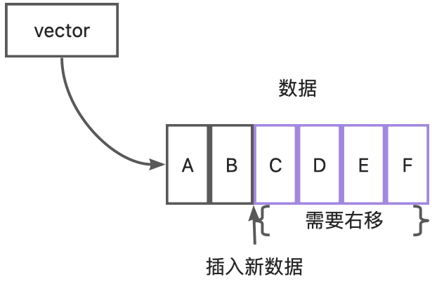
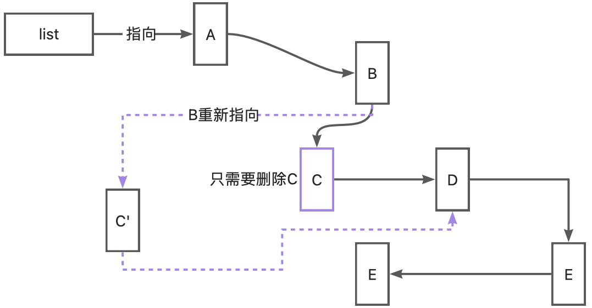
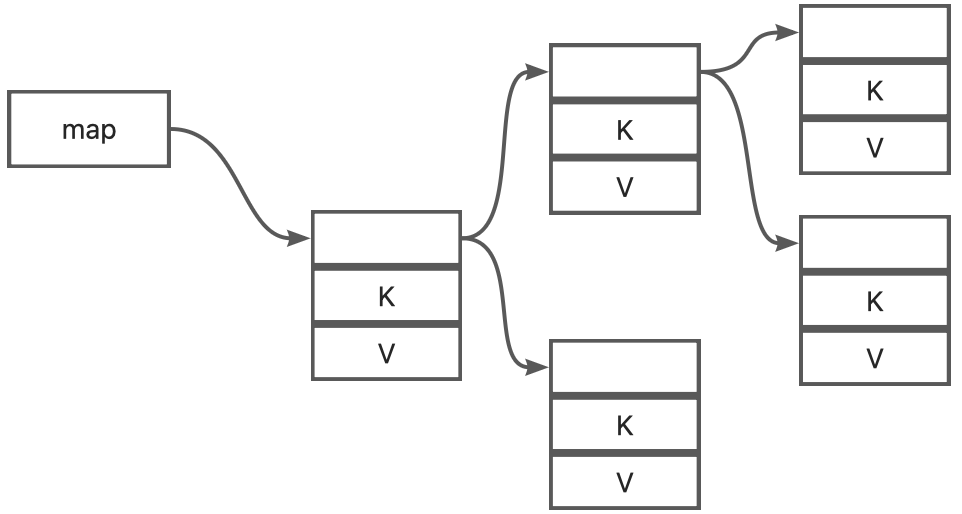
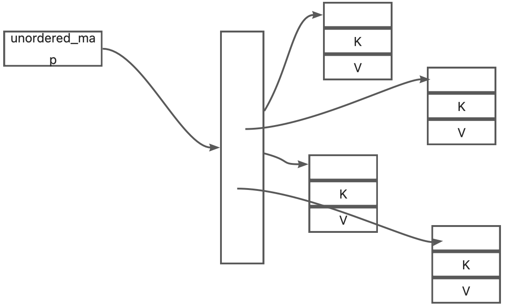
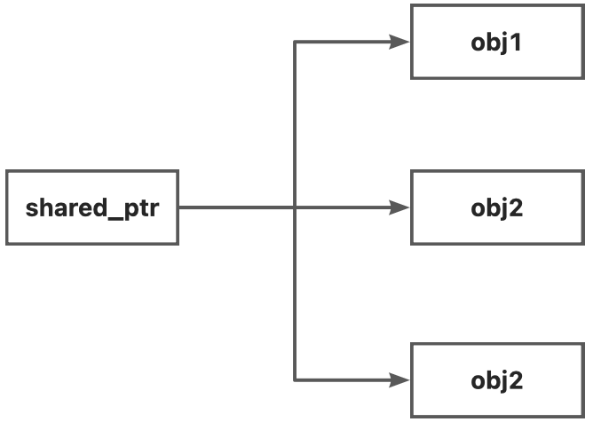
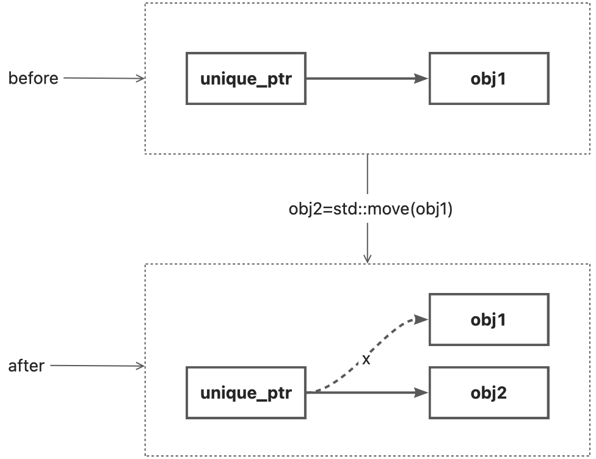

> In [the previous chapter](https://www.yuque.com/docs/share/adb5b1e4-f3c6-46fd-ba4b-4dabce9b4f2a?# Modern C++ Study Guide - The Type System) we explored the type system of C++ and proposed a low-to-high and again high-to-low study idea. This article is a study guide from high to low, and hopefully provides a new perspective.

## What is standard library
Programming languages are generally divided into two parts, one is the syntax part, such as the type system in the previous chapter, and the other part is the predefined toolset accomplished with this syntax, such as the subject of this article - the standard library. The standard library is a bunch of code that we can use directly when we write code, as if we had written it in advance. Not only that, the standard library is also cross-platform, or industrial-grade tested, so the standard library has the characteristics of reliability and security.
The C++ standard library includes many aspects, including classes `vector`, `string`, objects `std::cin`, `std::cout`, and functions `move`, `copy`, etc., so they are generally categorized according to their functions.

- Container
- Arithmetic
- Smart pointer
- Thread
- Other

Of course, these are not all, the standard library is constantly expanding and improving, the purpose of learning the standard library should also be to learn their use scenarios, rather than in-depth usage. For example, there are many container classes with similar functionality, and there are different options for different business scenarios. Through their understanding, we are more likely to write efficient, concise code.

## Container
A container class is a class that helps manage a set of data, and depending on how it is implemented, it is divided into ordered lists, unordered lists, and maps.
Ordered in an ordered list means that the data set is stored in a contiguous area of memory, and can be directly located to the original data by the index at the time of insertion. Because the data is stored sequentially, if you need to delete or add data in the middle of the process, the data on the right side of the operation position will need to be moved, and the operation will be more expensive. It can also be seen that their advantages are sequential insertion and tail modification, as well as direct lookup, which is represented by `array` and `vector`.
`array` is the encapsulation of the original array, and solves the problem of passing arrays as pointers, but the disadvantage is that its size is fixed, and it is suitable for use in cases where the amount of data is known. `vector` is an enhancement of `array` that not only does all the operations of `array`, but also has a variable size, so in most cases, `vector` is the ideal choice.

The elements of the unordered list are stored separately, with each other using pointers to find neighboring elements, because pointers can be easily modified to point to the finger, so the modification of neighboring elements becomes very fast. By the same token, finding neighboring elements can only be done by pointer jumps, find a value need to start looking from a pointer, a jump a piece of data, until the target is found or no data until. So the advantage of unordered lists is to delete and insert new data quickly, not suitable for lookup, which is represented by `list`, `forward_list`. Obviously, ordered and unordered lists are complementary, and we should **determine which container to choose based on the operation of the data in the actual project.**



A **map, on the other hand, combines the advantages of both ordered and unordered lists, allowing for fast insertion and deletion as well as fast lookups**. To fulfill various usage scenarios, C++ provides `map`, `multimap`, `unordered_map`, `unordered_multimap`. You can tell the difference between them by their names. To visualize it, I've made a direct table

|  | Sorted or not | Whether the same value is supported or not | speed |
| --- | --- | --- | --- |
| unordered_map | ❌ | ❌ | ❤️❤️❤️❤️ |
| map | ✅ | ❌ | ❤️❤️ |
| multimap | ✅ | ✅ | ❤️ |
| unordered_multimap | ✅ | ✅ | ❤️❤️❤️ |

A map stores two values, which are implemented differently for different types. Since `map` is required to be sorted, it is usually implemented as a kind of balanced binary tree, with the keys being the basis for its sorting.

An `unordered_map` does not need to be ordered, so its implementation is usually a hash table, i.e., it determines the index location and then the storage location based on the hash function.

In summary, the container class provides an interface to manipulate multiple data of the same type, and the developer can realize the addition, deletion, modification and checking of the data inside the container by calling the container class methods. In most cases, `vector` is a reliable choice, it provides a full-featured data manipulation interface, supports dynamic length, indexed queries, and is simple and efficient. If frequent insertion or deletion operations are required, you can also consider `list` or `forward_list`. `map` keeps data organized, `unorderer_map` is a better choice if you need more speed than sorting, and `multi` can be used if the same value occurs more than once. Container classes are also a good resource for learning about data structures. C++'s container classes provide almost all forms of data structures, and the more familiar you are with data structures, the better container class you can choose.
## Arithmetic
The reason why the algorithms are placed after the container classes is that the algorithms are mostly enhancements to the container class operations, and the algorithms are defined in the `algorithm` file header. These algorithms are short and concise, which can greatly increase code readability and properly handle many easily forgotten boundary issues. Functionality can be divided into add, delete, change and check several operations, you can actually have the need to check the documentation, you can refer to [here](https://cplusplus.com/reference/algorithm/)
## Smart pointer
A long time ago, I wasn't very nice about smart pointers. Because when I first started learning C++ I knew that you can't use pointers alone, you have to encapsulate them in a class and use the class constructor and destructor to manage the pointers, also known as `RAII`. At first I thought that was enough, until I came across the following situation
```cpp
public:
    Ptr():p{ new int } {}
    ~Ptr() {
        delete p;
    }
    int& get() {
        return *p;
    }

    void set(const int value) {
        *p = value;
    }
private:
    int* p;
};

void use(Ptr p) {
    //Passed in is a copy of the constructed p', after the function returns p' is destroyed, the two pointers point to the address is reclaimed, outside the p pointer becomes a wild pointer.
}
int main() {
    Ptr p;
    p.set(1);
    use(p); //p is passed by value, and the copy constructor of Ptr is called, constructing a new object p', whose pointer points to the same place as p's pointer
    std::cout << p.get() << std::endl; //p has been destroyed, access to p's address is illegal
    return 0;
}
```
When `use` is called, the variable `p` is copied, and there is a situation where two pointers point to a single memory address at the same time. After the `use` function is executed, its argument `p` is reclaimed. That is, the destructor of `Ptr` is called, which means that the addresses pointed to by the two pointers are reclaimed. So the call to `get` on line 24 to read the reclaimed address is illegal and the program crashes.
This is probably one of the more common problems encountered by novices, of course, to solve this problem is also very simple, you can not use smart pointers, you only need to change the parameter of the function `use` to a reference type, because the reference is just an alias, it will not generate new pointers, which is one of the reasons why I highly recommend references as the preferred parameter type in the type system chapter. For this example, the data is not large, directly rewrite the copy constructor, reclaim a piece of memory is also an idea.
This example uses Ptr in only one place, the actual project Ptr often need to be used many times, we can not guarantee that we will not forget to use the reference type of the situation, in this case re-apply for memory is not applicable, so this time you need to smart pointers to help.
Now think about another scenario, where we have to expose our pointers for external use for certain operations, and as the nesting and call chaining of operations increases, many times we forget or are unsure of when to call `delete` to free the memory. This is also a scenario where smart pointers are used. Both of these scenarios require shared pointers, which correspond to `shared_ptr` in smart pointers.
As the name `shared_ptr` suggests, it helps developers to accomplish the problem of sharing pointers, and perfectly solves the problems of releasing them early, not knowing when to release them, and who is responsible for releasing them. It corresponds to a one-to-many relationship, where an actual memory can be shared by more than one `shared_ptr`.

Another scenario is that we want **a pointer to belong to only one object at a time** from the beginning, and an external party wants to use it either through the object method that owns the pointer or by transferring ownership of the pointer to itself, which corresponds to `unique_ptr` in smart pointers.

The correspondence of `unique_ptr` is one-to-one; at any given moment, only one manager can have the pointer, and it is the only one responsible for releasing it. If you want to transfer this correspondence, you can only do so with the `std::move` operation, but after this operation, the pointer to the original object is invalidated, and it is no longer responsible for managing it; all the tasks are transferred to the new object. This feature is particularly suitable for resource-sensitive applications.
## Thread
Besides memory, threads are another important topic in development. The difficulty with threads is that not only do you have to manage the thread objects, but you also have to manage the resources managed by the thread objects and ensure data synchronization between threads. Of course the standard library has done a good enough job, we need to understand is the problem of the use of the scene. The thread library consists of a thread object `thread`, a condition object `condition_variable`, and a lock object `mutex`.
Using `thread` makes it easy to write programs as multithreaded in three steps:
```cpp
void plus(int a,int b){ //Step 1: Define the function to be run in the thread
    std::cout<<"running at sub thread"<<std::endl;
    std::cout<<"a + b = "<<a+b<<std::endl;
}

int main(){
    std::thread thread{plus,1,1}; //Step 2:define the std::thread object, taking the function as a parameter
    std::cout<<"continue running at main thread"<<std::endl;
    thread.join(); //Step 3:call the join function or detach function of the thread object
    std::cout<<"sub thread finished!"<<std::endl;
}
//  output
//	continue running at main thread
//	running at sub thread
// 	a + b = 2
// 	sub thread finished!
```
The difficulty is inter-thread communication, that is, solving two problems

1. thread 1 updates the value of variable v
2. thread 2 immediately reads the correct value of variable v, i.e., the latest value updated by thread 1.

In order to coordinate these two processes, there is a lock object `mutex` and a condition object `condition_variable`. The lock object `mutex` ensures that variables are changed in the correct order. The condition object `condition_variable` ensures that the changes are heard by other threads.
```cpp
int a,b;
bool ready = false;
std::mutex mux;
std::condition_variable con;

void plus() {
    std::cout << "running at sub thread" << std::endl;
    //Because we want to read the latest value of ready, we need to use a lock to ensure the validity of the read result
    std::unique_lock<std::mutex> guard{ mux };
    if (!ready) {
        //The data wasn't ready, take a break!
        con.wait(guard); 
    }
    //Here you can read the variables a,b correctly
    std::cout << "a + b =" << a + b << std::endl;
}

int main() {
    std::thread thread{ plus};
    std::cout << "continue running at main thread" << std::endl;
    std::cout << "input a = ";
    std::cin >> a;
    std::cout << "input b = ";
    std::cin >> b;
    {
        //Once the data is ready, it's time to notify the child threads to do their work, using curly braces because you want the lock to be released even if the guard is destroyed, and there is no guarantee that the lock will be reacquired inside PLUS.
        std::unique_lock<std::mutex> guard{ mux };
        //Updated data
        ready = true;
        //notification
        con.notify_all();
    }
    thread.join();
    std::cout << "sub thread finished!" << std::endl;
}
```
Another issue to be aware of with multithreading is deadlocks. Deadlocks are based on the premise that there are two locks

1. thread 1 has lock a and wants lock b
2. thread 2 has lock b, and wants lock a.

Then, add a premise: at a certain time, only one thread can have a certain lock, it is not difficult to conclude that: thread a, b unless one of the locks abandoned, otherwise both threads will not get the locks needed to wait for a deadlock. At the same time, the idea of solving the deadlock is also out: since a got a, a got b, and the lock at the same time can only be obtained by a thread, then all the threads according to the order of the first to get a, and then to get b, there will not be a lock is occupied problem. Another way to think about this is to start with abandonment. Since neither of them can get it, the next task can't be done, so you might as well just abandon the ones you've already got, so consider using `timed_mutex`.
## Other
There are also many commonly used libraries, such as string `string`, time `chrono`, as well as `functional`, exception `exception`, which are commonly used when defining function variables, and more can be found in [cplusplus](https://cplusplus.com/reference/) for reference.
## Summary
In general, the Standard Library provides a platform to show the power of the C++ language: it helps developers to accomplish their development tasks better and faster, and at the same time, it inspires developers to realize better abstractions and practices. For example, I have learned to define function parameters in a more standardized way, better encapsulation, and other good ideas from the library. Learning the standard library not only better grasp of the language itself, but also mastered a more comprehensive way to analyze the problem, problem-solving approach, it is worth spending a period of time to learn.
Container class is almost all projects will use, but also better to master, mainly from the data structure against the learning; smart pointers is a good helper to deal with the pointer problem; thread-related libraries is more difficult to master, the key is to understand the use of scenarios and extreme cases of boundary problems. Many times boundary issues may not be so intuitive. For example, the thread request to obtain the lock is divided into the following cases: the lock is idle, the lock is occupied by other threads, and the lock is occupied by itself. Different boundaries for different locks, the expected results are different, only in the case of clear scenarios, in order to better clarify the relationship between locks, so as to solve the problem.
The best way to learn is to actively use it in practice. For me, when I encounter a new problem, I usually check the standard library first to see if there is a corresponding library, and if there is, it's a good time to learn it. You can start with an overview of the definition of the library and the problem it solves, then analyze the classes, functions, objects, etc. it provides, then convert your understanding into code in the project, and finally test and revise your ideas in the real world to complete the learning of the library.
