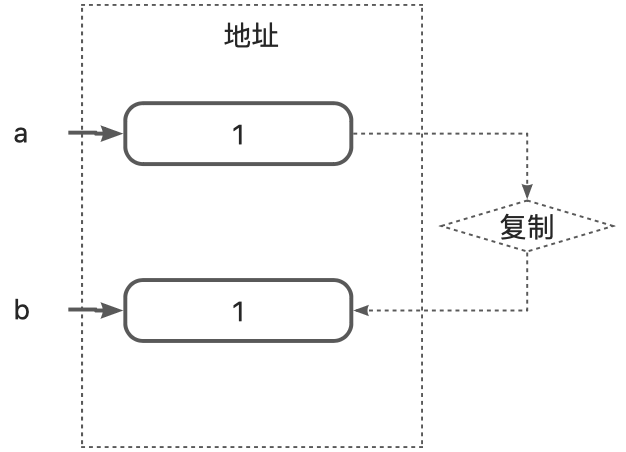
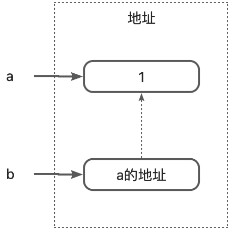
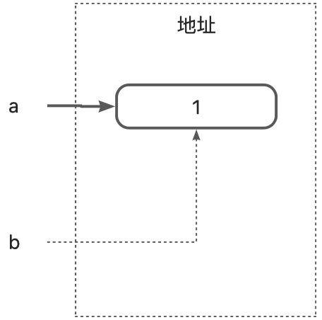

> 在前一篇，我们提供了一个方向性的指南，但是学什么，怎么学却没有详细展开。本篇将在前文的基础上，着重介绍下怎样学习C++的类型系统。

## 写在前面
在进入类型系统之前，我们应该先达成一项共识——尽可能使用C++的现代语法。众所周知，出于兼容性的考虑，C++中很多语法都是合法的。但是随着新版本的推出，有些语法可能是不推荐或者是需要避免使用的。所以本篇也尽可能采用推荐的语法形式（基于C++11或以上版本），这也是现代C++标题的含义。

采用现代语法有两点好处。其一，现代语法可以编译出更快更健壮的代码。编译器也是随着语言的发展而发展的，现代语法可以在一定程度上帮助编译器做更好的优化。其二，现代语法通常更简洁，更直观，也更统一，有助于增强可读性和可维护性。
明确了这点后，让我们一起踏入现代C++的大门吧。
## 类型系统
**程序是一种计算工具，根据输入，和预定义的计算方法，产生计算结果**。当程序运行起来后，这三者都需要在内存中表示成合适的值才能让程序正常工作，负责解释的这套工具就是类型系统。数字，字符串，键盘鼠标事件等都是数据，而且在内存中实际存在的形式也是一样的，但是按我们人类的眼光来看的话，对它们的处理是不一样的。数字能进行加减乘除等算术运算，但是对字符串进行算术运算就没有意义，而键盘鼠标的值通常只是读取，不进行计算的。正是由于这些差异，编程语言的第一个任务就是需要定义一套类型系统，告诉计算机怎样处理内存中的数据。
为了让编程语言尽可能简单，编程语言一般把类型系统分为两步实现，一部分是编译器，另一部分是类型。编译器那部分负责将开发者的代码解释成合适的形式，以便可以高效，准确在内存中表示。类型部分则定义一些编译器能处理的类型，以便开发者可以找到合适的数据来完成输入输出的表示和计算方法的描述。这两者相辅相成，相互成就。
类型作为类型系统的重要表现形式，在编程语言中的重要性也就不言而喻了。如果把写程序看成是搭积木的话，那么程序的积木就是类型系统。类型系统是开发者能操作的最小单位，它限制了开发者的操作规则，但是提供了无限的可能。C++有着比积木更灵活的类型系统。
## 类型
***类型是编程语言的最小单位，任何一句代码都是一种内存使用形式。***
而谈到C++的类型也就不得不谈到它的三种类型表现形式——普通类型，指针，引用。它们是三种不同的内存使用和解释形式，也是C++的最基础的形式。和大部分编程语言不同，C++对内置类型没有做特权处理，只要开发者愿意，所有的类型都可以有一致的语法形式（通过运算符重载），所以下面关于类型的举例适合所有的类型。
普通类型就是没有修饰的类型，如`int`,`long`,`double`等。它们是按值传递的，也就是赋值和函数传参是拷贝一份值，对拷贝后的值进行操作，不会再影响到老值。

```cpp
int a=1; //老值,存在地址1
int b=a; //新值，存在地址2
b=2; //改变新值，改变地址2
//此时a还是1，b变成了2
```


那假如我们需要修改老值呢，有两种途径，一种是指针，另一种则是引用。
指针是C/C++里面的魔法，一切皆可指针。指针包含两个方面，一方面它是指一块内存，另一方面它可以指允许对这块内存进行的操作。指针的值是一块内存地址，操作指针，操作的是它指向的那块地址。

```cpp
int a=1; //老值,存在地址1
int* b=&a; //&代表取地址，从右往左读，取a的地址——地址1，存在地址2
*b=2; //*是解引用，意思是把存在地址2(b)的值取出来，并把那个地址（地址1）的值改成2
//此时a，*b变成了2
```

引用则是指针的改进版，引用能避免无效引用，不过引用不能重设，比指针缺少一定的灵活性。
```cpp
int a=1; //老值,存在地址1
int& b=a; //&出现在变量声明的位置，代表该变量是引用变量，引用变量必须在声明时初始化
b=2; //可以像普通变量一样操作引用变量，同时，对它的操作也会反应到原始对象上
//此时a，b变成了2
```

## 变量定义
类型仅仅是一种语法定义，而要真正使用这种定义，我们需要用类型来定义变量，即变量定义。
C++变量定义是以下形式：
```cpp
type name[{initial_value}]
```
这里的关键在于`type`。`type`是类型和限定符的组合。看下面的例子：
```cpp
int a; //普通整型
int* b; //类型是int和*的组合，组成了整型指针
const int* c; //从右往左读，*是指针，const int是常量整型，组成了指向常量整型的指针类型
int *const d; //也是从右往左读，const是常量，后面是指针，说明这个指针是常量指针，指向最左边的int，组成常量指针指向整型
int& e=a; //类型是int和&的组合，组成了整型引用
constexpr int f=a+e; //constexpr代表这个变量需要在编译期求值，并且不再可变。
```
以上，基本就是变量定义的所有形式了，类型确定了变量的基本属性，而限定符限定了变量的使用范围。
定义变量也是按照这个步骤进行，**首先确定我们需要什么类型的变量，其次再进一步确定是否需要对这个变量添加限定，很多时候是需要的**。可以按以下步骤来确定添加什么样的限定符：

1. 是个大对象，可以考虑把变量声明成引用类型。通常引用类型是比指针类型更优的选择。
2. 大对象可能需要被重置，可以考虑声明为指针。
3. 只想要个常量，添加`constexpr`。
4. 只想读这个变量，添加`const`。
## 变量初始化
变量定义往往伴随着初始化，这对于局部变量来说很重要，因为局部变量的初值是不确定的，在没有对变量进行有效初始化前就使用变量，会导致不可控的问题。所以严格来说，前面的变量定义是不完全正确的。
C++11推出了全新的，统一的初始化方式，即在变量名后面跟着大括号，大括号里包着初始化的值。这种方式可以用在任何变量上，称之为统一初始化，如：
```cpp
int a{9527}; //普通类型
string b={"abc"}; //另一种写法，等价但是不推荐
Student c{"张三","20220226",18}; //大括号中是构造函数参数
```
当然，除了用类型名来定义变量外，还可以将定义和初始化合二为一，变成下面这种最简洁的形式：
```cpp
auto a={1}; //推导为整型
auto b=string{"abc"}; 
auto c=Student{"张三","20220226",18}
```
这里`auto`是让编译器自己确定类型的意思。上面这种写法是完全利用了C++的类型推导，这也是好多现代语言推荐的形式。不过需要注意的是，使用类型推导后，`=`就不能省略了。
有了初始化的变量后，我们就可以用它们完成各种计算任务了。C++为开发者实现了很多内置的计算支持。如数字的加减乘除运算，数组的索引，指针的操作等。还提供了分支`if`，`switch`，循环`while`，`for`等语句，为我们提供了更灵活的操作。
## 函数
变量是编程语言中的最小单位，随着业务的复杂度增加，有些时候中间计算会分散业务的逻辑，增加复杂度。为了更好地组织代码，类型系统增加了 函数来解决这个问题。
函数也是类型，是一种复合类型。它的类型由参数列表，返回值组合而成，也就是说两个函数，假如参数列表和返回值一样，那么它们从编译器的角度来看是等价的。当然光有它们还不够，不然怎么能出现两个参数列表和返回值一样的函数呢。一个完整的函数还需要有个函数体和函数名。所以函数一般是下面这种形式：
```cpp
//常规函数形式
[constexpr] 返回值 函数名(参数列表)[noexcept]{
    函数体
    }

//返回值后置形式
auto 函数名(参数列表)->返回值
```
当一个函数没有函数体的时候，我们通常称之为函数声明。加上函数体就是一个函数定义。
```cpp
void f(int); //函数声明
void fun(int value){  //函数定义，因为有大括号代表的函数体
    
}
```
以上就是函数的基本框架，接下来我们分别来看一看组成它的各部分。
先说最简单的函数名，**它其实是函数这种类型的一个变量，这个变量的值表示从内存地址的某个位置开始的一段代码块**。前面也说过之所以能出现两个参数列表和返回值都相同的函数，但是编译器能识别，其主要功劳就在函数名上，所以函数名也和变量名一样，是一种标识符。那假如反过来，函数名相同，但是参数列表或者返回值不同呢，这种情况有个专有名词——函数重载。基于函数是复合类型的认识，它们中只要其中一种不同就算重载。另外，在C++11，还有一种没有名字的函数，称为lambda表达式。lambda表达式是一种类似于直接量的函数值，就像13，'c'这种，是一种不提前定义函数，直接在调用处定义并使用的函数形式。
参数列表是前面类型定义的升级款。所有前面说的关于变量定义的都适用于它，三种形式的变量定义，多个变量，变量初始化等。不过，它们都有了新名词。参数列表的变量称为形式参数，初始化称为默认参数。同样形参在实际使用的时候需要初始化，不过初始化来自调用方。形式参数没有默认值就需要在调用的时候提供参数，有默认值的可以省略。
```cpp
int plus(int a,int b=1){ //b是一个默认参数
    return a+b;
}

int main(void){
    int c=plus(1); //没有提供b的值，所以b初始化为1，结果是2
    int d=plus(2,2); //a,b都初始化为2，结果是4
    //int f=plus(1,2,3); //plus只有两个形参，也就是两个变量，没法保存三个值，所以编译错误
    return 0;
}
```
和参数列表一样，返回值也是一个变量，这个变量会通过`return`语句返回给调用者，所以从内存操作来看，它是一个赋值操作。
```cpp
std::string msg(){
    std::string input;
    std::cin>>input;
    return input;
}

int main(void){
    auto a=msg();
    std::string b=msg();//msg返回的input复制到了b中
    return 0;
}
```
遗憾的是C++只支持单返回值，也就是一个函数调用最多只能返回一个值，假如有多个值就只能以形参形式返回了，这种方式对于函数调用就不是很友好，所以C++提出了新的解决思路。
## 类
随着业务的复杂度再次增加，函数形参个数可能会增加，或者可能需要返回多个值，然后在多个不同的函数间传递。这样会导致数据容易错乱，并且增加使用者的学习成本。
为了解决这些问题，工程师们提出了面向对象——多个数据打包的技术。表现在语言层面上，就是**用类把一组操作和完成这组操作需要的数据打包在一起**。数据作为类的属性，操作作为类的方法，使用者通过方法操作内部数据，数据不再需要使用者自己传递，管理。这对于开发者无疑是大大简化了操作。我们称之为面向对象编程，而在函数间传递数据的方式称为面向过程编程。这两种方式底层逻辑其实是一致的，该传递的参数和函数调用一样都不少，但是面向对象的区别是这些繁琐、容易出错的工作交给编译器来做，开发者只需要按照面向对象的规则做好设计工作就好了，剩下的交给编译器。至此，我们的类型系统又向上提升了一级。类不仅是多个类型的聚合体，还是多个函数的聚合体，是比函数更高级的抽象。
可以看下面面向过程编程和面向对象编程的代码对比
```cpp
struct Computer{
    bool booted;
    friend std::ostream& operator<<(std::ostream& os,const Computer & c){
        os<<"Computing";
        return os;
    }
};

void boot(Computer& c){
    c.booted=true;
    std::cout<<"Booting...";
}

void compute(const Computer& c){
    if(c.booted){
       std::cout<<"Compute with "<<c;
    }
}

void shutdown(Computer& c){
    c.booted=false;
    std::cout<<"Shutdown...";
}

int main(void){
    auto c=Computer();
    boot(c);
    compute(c);
    shutdown(c);
    return 0;                                                                                                         
}
```
面向过程最主要的表现就是，开发者需要在函数间传递数据，并维护数据状态，上面例子中的数据是`c`。
```cpp
struct Computer{
    bool booted;
    
    friend std::ostream& operator<<(std::ostream& os,const Computer & c){
        os<<"Computing";
        return os;
    }

    void boot(){
        booted=true;
        std::cout<<"Booting...";
    }

    void compute(){
        if(booted){
            std::cout<<"Compute with "<<this;
        }
    }

    void shutdown(){
        booted=false;
        std::cout<<"Shutdown...";
    }
};

int main(void){
    auto c=Computer();
    c.boot();
    c.compute();
    c.shutdown();
    return 0;
}
```
可以看出面向对象的代码最主要的变化是，方法的参数变少了，但是可以在方法里面直接访问到类定义的数据。另一个变化发生在调用端。调用端是用数据调用方法，而不是往方法里面传递数据。这也是面向对象的本质——以数据为中心。
当然，类的封装功能只是类功能的一小部分，后面我们会涉及到更多的类知识。作为初学者，我们了解到这一步就能读懂大部分代码了。
## 总结
类型系统是一门语言的基本构成部分，它支撑着整个系统的高级功能，很多高级特性都是在类型系统的基础上演化而来的。所以学习语言的类型系统有个从低到高，又从高到低的过程，从最基础的类型开始，学习如何从低级类型构筑出高级类型，然后站在高级类型的高度上，审视高级类型是怎样由低级类型构筑的。这一上一下，一高一低基本上就能把语言的大部分特性了解清楚了。
低级类型更偏向于让编译器更好地工作，高级类型偏向于让开发者更好地工作，C++从普通类型，函数，类提供了各个层级的支持，让开发者有更多自由的选择，当然也就增加了开发者的学习难度。但是开发者并不是都需要所有选择的，所以我觉得正确的学习应该是以项目规模为指导的。一些项目，完全用不到面向对象，就可以把精力放在打造好用的函数集上。而有的项目，面向对象是很好的选择，就需要在类上花费时间。回到开头的积木例子，选用什么积木完全看我们想搭什么模型，要是没有合适的积木，我们可以自己创造。这就是C++的迷人之处。