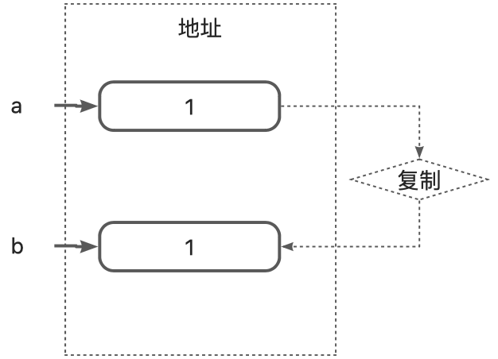
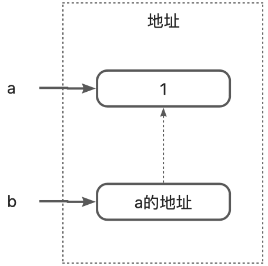
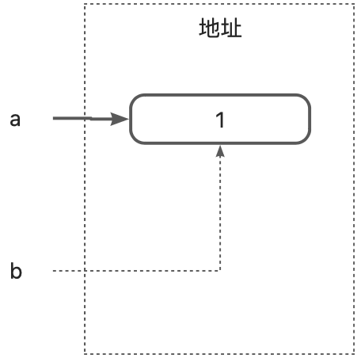

> In the previous post, we provided a directional guide, but what and how to learn was not developed in detail. This article will build on the previous article and focus on how to learn C++'s type system.

## Before the start
Before we get into the type system, there is one thing we should agree on - use the modern syntax of C++ whenever possible. It is well known that many syntaxes in C++ are legal for compatibility reasons. But as new versions are released, some syntax may not be recommended or needs to be avoided. So this post also uses the recommended form of syntax (based on C++11 or above) whenever possible, which is what the title Modern C++ means.

There are two benefits to using modern syntax. One, modern syntax can compile faster and more robust code. Compilers evolve as languages evolve, and modern syntaxes can help compilers do better optimization to some extent. Second, modern syntaxes are often more concise, intuitive, and uniform, which helps increase readability and maintainability.
With that clear, let's get our foot in the door of modern C++.
## Type system
**A program is a computational tool that produces computational results based on inputs, and predefined computational methods**. When the program is run, all three need to be represented in memory as appropriate values for the program to work properly, and the set of tools responsible for interpreting this is the type system. Numbers, strings, keyboard and mouse events, etc. are all data and actually exist in memory in the same form, but are treated differently when viewed through our human eyes. Numbers can be added, subtracted, multiplied, divided, and other arithmetic operations, but arithmetic operations on strings are meaningless, and keyboard and mouse values are usually just read, not calculated. It is because of these differences that the first task of a programming language is the need to define a type system that tells the computer what to do with the data in memory.
In order to make programming languages as simple as possible, programming languages generally implement the type system in two steps, one for the compiler and the other for the types. The compiler part is responsible for interpreting the developer's code into a suitable form so that it can be efficiently and accurately represented in memory. The type part defines the types that the compiler can handle, so that the developer can find the right data to accomplish the representation of inputs and outputs and the description of computational methods. The two complement and fulfill each other.
The importance of types as an important representation of the type system in a programming language cannot be overstated. If you think of writing a program as building blocks, then the blocks of the program are the type system. The type system is the smallest unit that the developer can manipulate, it limits the rules of operation, but provides unlimited possibilities. c++ has a type system that is more flexible than the building blocks.
## Type
***Types are the smallest unit of a programming language, and any sentence of code is a form of memory usage.***
Talking about types in C++ also brings us to its three types of representation - normal types, pointers, and references. They are three different forms of memory usage and interpretation, and are the most basic forms of C++. Unlike most programming languages, C++ does not privilege built-in types, and all types can have a consistent syntax (via operator overloading) if the developer wants them to, so the following examples of types are suitable for all types.
Common types are types without modifiers, such as `int`, `long`, `double`, etc. They are passed by value, i.e., assignments and function passes make a copy of the value. They are passed by value, which means that assignments and function passes make a copy of the value, and operations on the copied value do not affect the old value any further.

```cpp
int a=1; //old value, exists at address 1
int b=a; // new value, exists at address 2
b=2; //change new value, change address 2
// At this point a is still 1 and b becomes 2
```


So what if we need to modify the old value, there are two ways to do this, one is a pointer and the other is a reference.
Pointers are the magic inside C/C++, everything is a pointer. A pointer has two aspects, on the one hand it refers to a block of memory and on the other hand it can refer to the operations that are allowed to be performed on that block of memory. The value of a pointer is a block of memory address, and by manipulating a pointer, you manipulate the block of address it points to.

```cpp
int a=1; //old value, exists at address 1
int* b=&a; //& stands for fetch address, read from right to left, fetch address of a - address 1, exist address 2
*b=2; //* is dereferencing, meaning take out the value that exists at address 2(b) and change the value at that address (address 1) to 2
// At this point a, *b becomes 2
```

References are an improved version of pointers. References avoid invalid references, but they cannot be reset and lack a certain degree of flexibility over pointers.
```cpp
int a=1; //old value, exists at address 1
int& b=a; //& appears at the position of the variable declaration, which means that the variable is a reference variable, and reference variables must be initialized at the time of declaration
b=2; // you can manipulate a reference variable like a normal variable, and at the same time, operations on it will be reflected on the original object
// At this point a, b becomes 2
```

## Variable definitions
A type is just a syntactic definition, and to actually use that definition, we need to define variables in terms of types, i.e. variable definitions.
C++ variable definitions are of the following form:
```cpp
type name[{initial_value}]
```
The key here is `type`. `type` is a combination of type and qualifier. Look at the following example:
```cpp
int a; // Ordinary integer
int* b; //The type is a combination of int and *, forming an integer pointer
const int* c; //reading from right to left, * is a pointer and const int is a constant integer, making up the type of pointer to a constant integer
int *const d; // also read from right to left, const is constant, followed by a pointer, indicating that this pointer is a constant pointer to the leftmost int, which consists of constant pointers to integers
int& e=a; //The type is a combination of int and &, forming an integer reference
constexpr int f=a+e; //constexpr means that this variable needs to be evaluated at compile time and is no longer mutable.
```
Above, basically all the forms of variable definition, the type determines the basic attributes of the variable, and the qualifier limits the scope of the variable's use.
Defining a variable follows this same procedure, **first determining what type of variable we need, and secondly further determining if we need to add a qualifier to that variable, which many times is required**. The following steps can be followed to determine what kind of qualifier to add:

1. is a large object, consider declaring the variable as a reference type. Usually reference types are a better choice than pointer types.
2. Large objects may need to be reset, consider declaring them as pointers.
3. Just want a constant, add `constexpr`.
4. To read only this variable, add `const`.
## Variable initialization
Variable definitions are often accompanied by initialization, which is important for local variables because the initial value of a local variable is uncertain, and using a variable without effectively initializing it can lead to uncontrollable problems. So strictly speaking, the preceding variable definition is not entirely correct.
C++11 introduced a new, unified way of initializing variables, where the variable name is followed by curly braces that enclose the initialized value. This approach can be used for any variable and is called uniform initialization, as in:
```cpp
int a{9527}; // common type
string b={"abc"}; //another way to write, equivalent but not recommended
Student c{"ZhangSan", "20220226",18}; //in curly brackets are constructor parameters
```
Of course, in addition to defining a variable by its type name, you can also combine definition and initialization into the cleanest form below:
```cpp
auto a={1}; // deduce to integer
auto b=string{"abc"}; 
auto c=Student{"Zhang San", "20220226",18}
```
Here `auto` means to let the compiler determine the type itself. The above is written in a way that makes full use of C++'s type derivation, which is the recommended form for many modern languages. Note, however, that `=` cannot be omitted when type derivation is used.
Once we have initialized variables, we can use them for a variety of computational tasks.C++ implements a lot of built-in computational support for developers. C++ implements a lot of built-in computational support for the developer, such as addition, subtraction, multiplication and division of numbers, indexing of arrays, pointer manipulation, etc. There are also branching `if`, `switch`, looping `while`, `for`, etc. statements which provide us with more flexibility.
## Functions
Variables are the smallest unit in a programming language, and as the complexity of a business increases, there are times when intermediate computations distract from the logic of the business and add complexity. In order to better organize the code, the type system adds functions to solve this problem.
A function is also a type, a composite type. Its type consists of a combination of argument list and return value, which means that two functions, if they have the same argument list and return value, are equivalent from the compiler's point of view. Of course, they are not enough, otherwise how can there be two parameter list and return value of the same function. A complete function also needs to have a function body and function name. So a function is usually of the following form:
```cpp
// Regular function form
[constexpr] return value Function name (argument list) [noexcept]{
    function body (math.)
    }

// Return value in postfixed form
auto function name (argument list) -> return value
```
When a function does not have a body, we usually call it a function declaration. Adding a function body is a function definition.
```cpp
void f(int); //function declaration
void fun(int value){ // function definition as represented by curly braces function body
    
}
```
This is the basic framework of a function, so let's take a look at each of the parts that make it up.
First of all, the simplest function name, **it is actually a function of this type of a variable, the value of this variable represents a block of code starting from a certain location in the memory address**. As I said earlier, the reason why there can be two parameter lists and return values are the same function, but the compiler can identify, the main credit in the function name, so the function name is also the same as the name of the variable, is a kind of identifier. Then if the reverse, the same function name, but the parameter list or return value is different, this situation has a term - function overloading. Based on the understanding that functions are composite types, it is considered overloading if only one of them is different. In addition, in C++11, there is another kind of function without a name, called a lambda expression. lambda expressions are a kind of function value that is similar to a direct quantity, like 13, 'c', which is a kind of function that is not defined ahead of time, but is defined and used directly at the caller.
The parameter list is an upgrade from the previous type definitions. All of what was said earlier about variable definitions applies to it, all three forms of variable definitions, multiple variables, variable initialization, etc. However, they all have new terms. Variables with a list of parameters are called formal parameters and initialization is called default parameters. Similarly formal parameters need to be initialized when they are actually used, but the initialization comes from the caller. Formal parameters without defaults need to be supplied at the time of calling and those with defaults can be omitted.
```cpp
int plus(int a,int b=1){ //b is a default parameter
    return a+b;
}

int main(void){
    int c=plus(1); // no value for b is provided, so b is initialized to 1, resulting in 2
    int d=plus(2,2); //a,b are initialized to 2, resulting in 4
    //int f=plus(1,2,3); //plus has only two formal parameters, i.e. two variables, so it can't hold three values, so it compiles incorrectly.
    return 0;
}
```
Like the argument list, the return value is a variable that is returned to the caller via a `return` statement, so in terms of memory manipulation, it is an assignment operation.
```cpp
std::string msg(){
    std::string input;
    std::cin>>input;
    return input.
}

int main(void){
    auto a=msg();
    std::string b=msg();//the input returned by msg is copied into b
    return 0;
}
```
Unfortunately, C++ only supports a single return value, that is, a function call can only return a maximum of one value, if there is more than one value can only be returned in the form of a formal parameter, this way for the function call is not very friendly, so C++ proposed a new solution.
## Classes
As the complexity of the business increases again, the number of formal parameters of a function may increase, or it may be necessary to return multiple values that are then passed between several different functions. This can lead to easily misplaced data and increased learning costs for the user.
To solve these problems, engineers came up with object-oriented - multiple data packaging techniques. Expressed at the language level, it is **using classes to package together a set of operations and the data needed to complete this set of operations**. Data as a class attribute, operation as a class method, the user through the method to operate the internal data, data no longer need to pass the user, management. This is undoubtedly for the developer is greatly simplified operation. We call this object-oriented programming, and the way to pass data between functions is called procedure-oriented programming. The underlying logic of these two ways is in fact the same, the transfer of parameters and function calls are not less, but the difference between object-oriented is that these cumbersome, error-prone work to the compiler to do, the developer only needs to do a good job in accordance with the rules of the design of the object-oriented work on it, the rest to the compiler. At this point, we have moved up one level in our type system. Classes are not only aggregates of multiple types, they are also aggregates of multiple functions, a higher level of abstraction than functions.
You can see the following code comparison between procedural and object-oriented programming
```cpp
struct Computer{
    bool booted;
    friend std::ostream& operator<<(std::ostream& os,const Computer & c){
        os<<"Computing";
        return os.
    }
};

void boot(Computer& c){
    c.booted=true;
    std::cout<<"Booting..." ;
}

void compute(const Computer& c){
    if(c.booted){
       std::cout<<"Compute with"<<c;
    }
}

void shutdown(Computer& c){
    c.booted=false;
    std::cout<<"Shutdown..." ;
}

int main(void){
    auto c=Computer();
    boot(c).
    compute(c).
    shutdown(c).
    return 0;  
}
```
The most significant manifestation of procedural orientation is that the developer needs to pass data between functions and maintain the data state, which in the above example is `c`.
```cpp
struct Computer{
    bool booted;
    
    friend std::ostream& operator<<(std::ostream& os,const Computer & c){
        os<<"Computing";
        return os.
    }

    void boot(){
        booted=true;
        std::cout<<"Booting..." ;
    }

    void compute(){
        if(booted){
            std::cout<<"Compute with"<<this;
        }
    }

    void shutdown(){
        booted=false;
        std::cout<<"Shutdown..." ;
    }
};

int main(void){
    auto c=Computer();
    c.boot();
    c.compute();
    c.shutdown();
    return 0;
}
```
The most significant change that can be seen in object-oriented code is that methods have fewer parameters, but the data defined by the class can be accessed directly inside the method. Another change occurs on the calling side. Instead of passing data to the method, the caller calls the method with data. This is the essence of object-orientation - it is data-centric.
Of course, the encapsulation function of the class is only a small part of the class function, we will cover more class knowledge later. As a beginner, we understand this step will be able to read most of the code.
## Summary
The type system is the basic component of a language, which supports the high-level functions of the whole system, and many high-level features are evolved on the basis of the type system. Therefore, learning the type system of a language is a process from low to high, and from high to low. Starting from the most basic types, we learn how to construct high-level types from the low-level types, and then stand on the height of high-level types, and examine how the high-level types are constructed from the low-level types. This up and down, high and low basically makes most of the features of the language clear.
Low-level types are more oriented towards making the compiler work better, and high-level types are more oriented towards making the developer work better. C++ provides various levels of support from common types, functions, and classes, which gives the developer more freedom of choice, and of course makes it more difficult for the developer to learn. But developers don't always need all the choices, so I think the right learning should be guided by the size of the project. Some projects, which don't use object orientation at all, can focus on building function sets that work well. And there are projects where object orientation is a good choice, and time needs to be spent on classes. Going back to the building blocks example at the beginning, the choice of building blocks depends entirely on what we want to model, and if we don't have the right ones, we can create our own. That's the beauty of C++.

