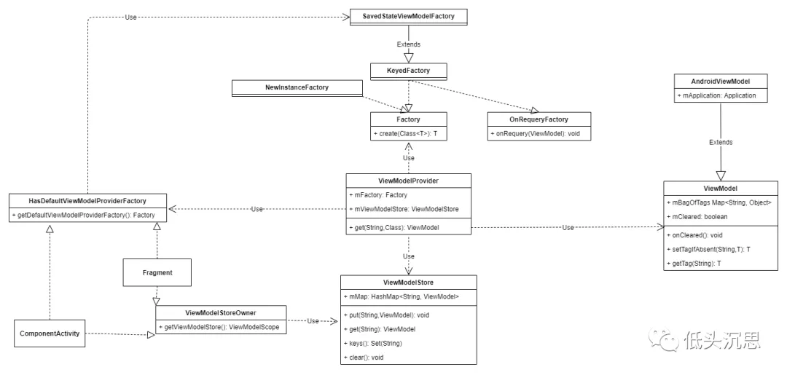

> ViewModel做为架构组件的三元老之一，是实现MVVM的有力武器。

## ViewModel的设计目标
ViewModel的基本功能就是管理UI的数据。其实，从职责上来说，这又是对Activity和Fragment的一次功能拆分。以前存储在它们内部的数据，需要它们自己处理创建，更新，存储，恢复的所有过程，同时它们还要处理UI的数据绑定，更新，动画等操作。职责的多元化就容易出现不好定位和调试的问题。另外，Activity和Fragment作为UI的承载者，很多时候需要共享数据和复用功能。而UI的差异让复用的粒度划分很难把控，容易写出扩展性差的代码。基于这些痛点，ViewModel被设计出来了。
同时ViewModel还将保存数据的功能强化了——它将设备配置变更后数据保存和恢复自动化了，在UI生命周期内都能保证数据的有效性，这大大减少了样板代码的编写，提高了开发效率。

## ViewModel的架构设计
*** ViewModel用了两种粒度划分来完成数据管理功能。*** 第一层是对ViewModel自身存储数据的管理。目标就是完成ViewModel的创建，对应的抽象实体是`ViewModelProvider.Factory`。第二层则是对已存在的ViewModel组的管理，目标就是保证意外情况下ViewModel的有效性，对应的抽象实体是ViewModelStore。当然，这些都只是概念上的抽象，还需要一个粘合剂把它们的抽象层级体现出来，这就是ViewModelProvider。这三个主体类共同搭建了ViewModel的体系框架。剩下的类都是对这三个概念的补充和完善。接下来我将分别以这些抽象为主线，逐层分析它们的实现逻辑。

## ViewModel的组管理
前面也提到过，ViewModelStore是完成组管理的，那么我们首先应该确定的是组的概念,也就是这些ViewModel都归属于谁的问题。这不难理解，要管理组，那就必须得找到组的主人啊，由此引申出了ViewModelStoreOwner，它代表着某个拥有组管理权限的对象，通过它提供的ViewModelStore对象就能对里面的ViewModel进行管理了，同时这些ViewModel也就共同形成了组。所以ViewModelStoreOwner其实就是组的抽象实体，它代表着某个组，也是管理分组的单位。
ViewModel有两个默认实现的组——ComponentActivity和Fragment。也就是说ComponentActivity和Fragment都实现了ViewModelStoreOwner这个接口。
先来看ComponentActivity的实现。根据接口，首先查看接口方法`getViewModelStore`的实现。里面主要涉及到两个对象，一个就是ViewModelStore的引用`mViewModelStore`，另一个就很有意思了，它是一个NonConfigurationInstances对象，这是一个简单类，就是保存ViewModelStore对象的。那么它特殊在什么地方呢？它是`onRetainNonConfigurationInstance`方法的返回对象。

> 插一个课外知识科普，`onRetainNonConfigurationInstance`是Activity的一个方法，这个方法是设备配置发生变化（如横竖屏切换的时候）时被系统自动调用的，用于用户保存数据。只要这个方法返回的对象，在设备配置放生改变时都不会被销毁。稍后在重建完成后，可以通过`getLastNonConfigurationInstance`方法获取到。

接着回到`getViewModelStore`的实现，刚才说到NonConfigurationInstances对象，它是通过调用`getLastNonConfigurationInstance`方法获得的。如果方法返回了有效的对象，说明Activity被重建了，就直接获取保存在NonConfigurationInstances对象中的值，然后更新`mViewModelStore`。否则就说明还没有有效的ViewModelStore对象，则直接创建。从这个逻辑不难看出，我们的ViewModel不会随着设备变化而重建，这正好满足了我们的设计目标。那么对于Fragment，它的实现又是怎样的呢。
Fragment的实现比较曲折，它直接委托给了FragmentManager,又委托给了FragmentManagerViewModel的`getViewModelStore`方法，方法实现也很简单，就是对`HashMap`查找，没有就创建新的。这显然不是我们想看到的，因为这里并没有和Activity类似的处理状态变更的逻辑。那么唯一的突破点就是那个HashMap对象了。搜索一圈发现，它会作为getSnapshot方法的返回值返回，有点Activity那味了。往上回溯，会发现它最终就是作为不销毁的对象，在Fragment销毁前保存下来了。
以上就是两种应用场景下ViewModelStore的创建逻辑，另外，还有清除逻辑没有讲到。这个逻辑本质上就是调用ViewModelStore的clear方法，唯一的问题就是确定调用时机。具体来说就是，Activity通过注册`Lifecycle`的状态监听，在`Lifecycle.Event.ON_DESTROY`的时候，调用了`clear`方法,而Fragment则是继续通过FragmentManager的`desctory`方法作为调用的入口点。在FragmentManagerViewModel里完成了方法调用。
总结一下，ViewModelStoreOwner是对ViewModel组的一种抽象。虽然对应着两个不同的实现，但是殊途同归，***最终的目的就是保证在设备配置发生变化的时候对应ViewModelStore对象的有效性，*** 从而保证ViewModel对象的有效性。同时在真正需要销毁的时候做好清理工作。这就是这ViewModel的组管理功能。

## ViewModel的创建管理
ViewModel用`ViewModelProvider.Factory`来管理创建过程。具体来说就是怎样根据一个ViewModel子类的类信息创建对应的对象。这有两个难点——必要的依赖注入、数据的恢复。对于依赖注入，ViewModel还是耍了老把戏，和创建ViewModelStore类似，提供了`HasDefaultViewModelProviderFactory`的一个抽象，把依赖注入转移到了ComponentActivity和Fragment中。之所以这么做，是因为在创建ViewModel的过程中，可能需要使用到Application和Bundle等信息，而这些信息是只能在在Activity和Fragment中才能获取到的。数据恢复则是关注怎样利用现有的数据将对象恢复到原来的状态。当然这些过程其实都可以没有，不需要传递Application或者Bundle对象，不需要恢复ViewModel状态，则库提供了默认的实现。就是简单的调用反射创建对象而已。
针对刚才说的各种情况，`ViewModelProvider.Factory`有多个实现，那么实际上它到底是使用哪个实现呢，我们得从ViewModelProvider中寻找答案。在它的构造方法里，会对ViewModelStoreOwner做类型判断，假如它是`HasDefaultViewModelProviderFactory`的实例，则使用实例返回的对象，否则默认的实现。结合上面的分析，让我们继续到ComponentActivity和Fragment中寻找答案。不看不知道，一看吓一跳，它们竟然都是使用了SavedStateViewModelFactory类，那么我们一起来看看它是怎么实现的吧。
在构建SavedStateViewModelFactory对象的时候，会传入三个对象——Application,SavedStateRegistryOwner,Bundle,这三个对象中最重要的就是第二个，它的主要功能就是提供在SavedStateRegistry对象，这个对象会在合适的时候保存数据，然后在合适的时候再恢复过来。它也是生命周期感知的组件。在它的`create`方法里，也是通过反射构建ViewModel对象的，唯一的不同就是反射多了个参数。接着往下看，最终会利用这些信息构造出SavedStateHandle对象，这个对象就是真正对我们当前创建的ViewModel对象有用的信息。SavedStateHandle提供了根据键值对保存数据的方法，也提供了查询方法，所以ViewModel可以根据这个对象，恢复自己的LiveData数据，最重要的，这个类还提供了LiveData的另一个子类SavingStateLiveData，能自动处理数据保存的问题。
一句话总结，ComponentActivity和Fragment会使用SavedStateViewModelFactory对象作为ViewModelProvider中的`Factory`来创建ViewModel。只要ViewModel提供了带有Application或者SavedStateHandle的构造方法，就能享受从Bundle中恢复数据的便利。

## ViewModel的粘合剂ViewModelProvider
为什么说ViewModelProvider是粘合剂呢？因为这个类就做了一件事，把ViewModelStore和`ViewModelProvider.Factory`组合起来，实现了一个叫get的方法，这个方法的内部实现就是有两个步骤。

1. 调用ViewModelStore的`get`方法查询是否有创建好的对象，如果有就返回，方法结束，否则进入步骤2。

2. 调用`ViewModelProvider.Factory`的`create`方法创建对象，并将之保存到ViewModelStore中。

所以当我们要使用ViewModel的时候，通常是创建ViewModelProvider对象，然后调用`get`方法获取真正的ViewModel对象，这样，我们的对象就具备了正确处理设备配置变更的能力。

## ViewModel的Fragment间通信功能
根据前面的梳理，我们知道，ViewModelStore是管理某个ViewModel组的，只要我们保证ViewModelStore存在，我们就可以保证ViewModel存活。再反推一步，要保证ViewModelStore存活，我们就要保证ViewModelStoreOwner在不同的地方都能返回同一个ViewModelStore对象，而ComponentActivity和Fragment是都实现了这个接口的。结合Activity的生命周期通常是大于Fragment这一事实，不难得出结论——***在某个Fragment里面，用Activity对象创建ViewModelProvider对象，就能保证获取到和Activity一样的ViewModelStore对象，也就能保证获取到相同的ViewModel对象。只要Activity没有销毁，该Activity下的所有Fragment都能获取到相同的ViewModel对象，然后通过更改状态能方式完成通信。***

到此，对ViewModel的分析告一段落了，对创建过程的两次抽象是我觉得最精彩的环节，另外对现有条件（Activity和Fragment的生命周期）的利用也是它独到之处，真的是受益匪浅。青山不改，绿水长流，咱们下期见！

