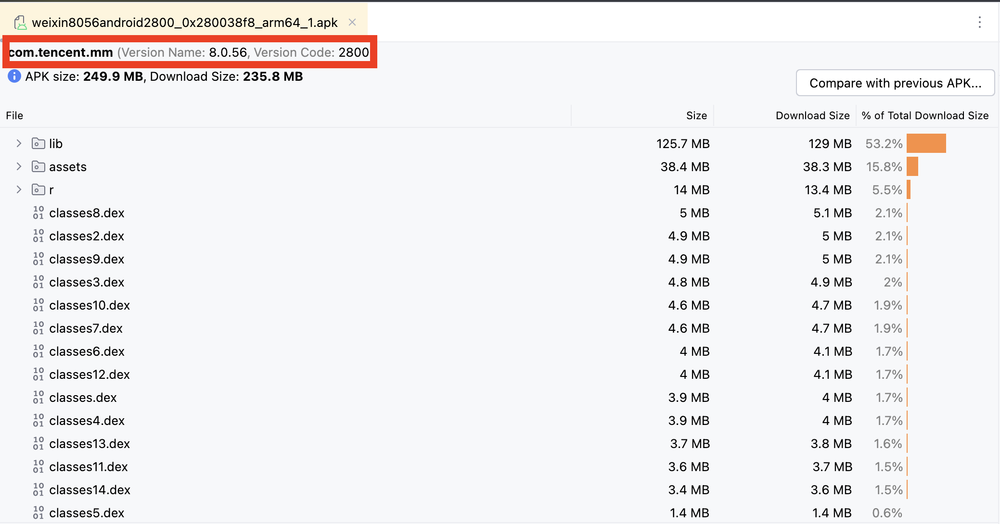
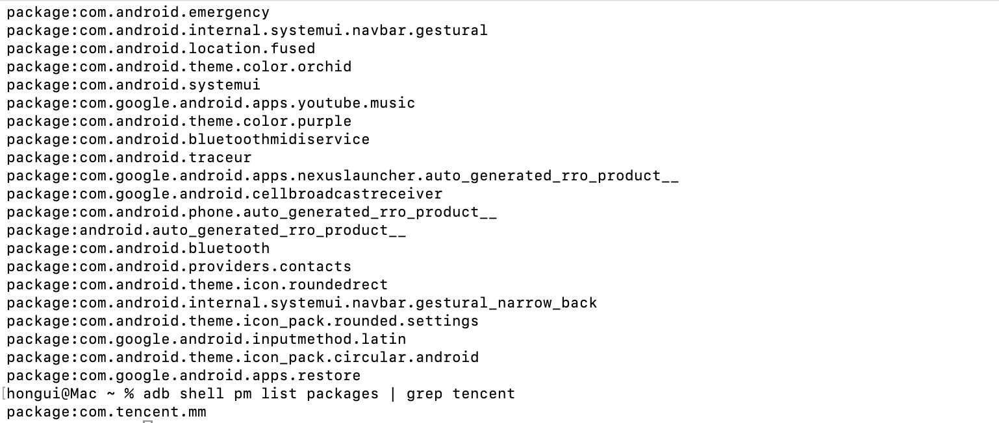
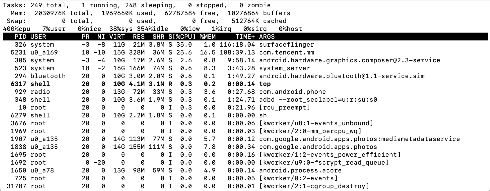
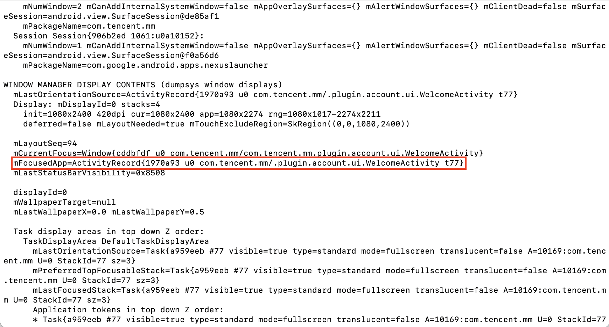

## Get package via Android Studio
If we can get the Apk file, then drag the Apk directly into Android Studio, Android Studio will automatically parse the file, and after successful parsing it will open a new tab, and at the top of the tab you can see the package name


## Get package via pm list packages
If we can get the Apk file, then drag the Apk directly into Android Studio, Android Studio will automatically parse the file, and after successful parsing it will open a new tab, and at the top of the tab you can see the package name
```bash
adb shell pm list packages | grep com.example.app
```


## Get package via adb shell top
If we don't know anything about the application, then we have to run the application. A running application takes up resources and can be located by looking at the output of `top` and further determining the package name from the `ARGS` column. If the output is truncated, you can enter the `shell` environment before executing the `top` command.


## Get package adb shell dumpsys window
Actually the above two commands are still too slow for locating the application, the fastest way is to use `dumpsys window` directly. Again we run the application, but this time instead of looking at the resource usage of the application, we locate the application based on the current window focus, and the window related one is definitely looking for `dumpsys window`. The output may be different for different versions of the system, but the same is true, in one of the output lines there will be something like the following output
```bash
mFocusedApp=ActivityRecord{1970a93 u0 com.tencent.mm/.plugin.account.ui.WelcomeActivity t77}
```
Start with `mFocusedApp`, after `u0` and before `/` is the package name, after `/` is the name of the `Activity`.
